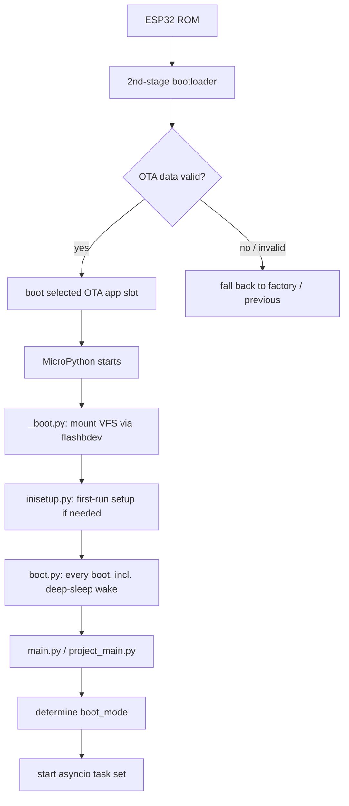

## Boot sequence

- The bootloader validates the appended image SHA-256 and the OTA-data partition,
  then jumps into the selected app slot. Failed or rolled-back updates land on the
  previous good slot (see [OTA](/subsystems/ota)).
- `_boot.py` mounts the filesystem through `flashbdev.py` (the flash block device).
- `inisetup.py` performs first-boot filesystem setup.
- `boot.py` (a VFS file on flash, distinct from the frozen `_boot.py`) runs on every boot,
  including wake from deep sleep, immediately before `main.py`.
- `main.py` / `project_main.py` bring up the application: event bus, task manager,
  LEDs, radios, GNSS, and the compass state machine. In v5.0.3 `compass.start` launches
  the ESP-NOW comms task via `enow_v2.communicate_supervised`, which restarts it on a
  crash (v5.0.2: `communicate_v2` directly).

## Power / boot modes

`device_power.py` tracks an application-level `boot_mode` and a battery-health state. Observed
states and transitions (from log strings and symbols):

| Concept | Values / evidence |
| --- | --- |
| App `boot_mode` | `BOOT_POWER_ON`, `BOOT_SHUTDOWN` — app-level values, distinct from the ESP reset cause below |
| Desired boot mode | `Power Control \| Desired boot_mode: {}` |
| Power mode | app aliases `PM_PERF` / `PM_PWRSAVE` mapped to the ESP32 esp_pm tiers `PM_PERFORMANCE` / `PM_POWERSAVE`, with `is_power_perf` / `is_power_constant` / `is_power_down` / `is_powered` state flags; switch logged as `Changing power mode from {} to: {}`. Numeric enum ids are not string-extractable. |
| Eco / idle profile | timed low-activity profile (`eco_mode_sec`, `is_eco_mode`, `evt_idle`) plus a peripheral power gate (`pwr_gate_pin`) |
| Battery health | `Changing battery health to: {}`; confirmed health signals are the events `evt_battery_charged` and `evt_battery_usable` (the full enum is not string-extractable). Low battery first locks out features (`Battery too low for BLE`, `Battery too low for OTA update`) before the hard low-voltage cutoff. |
| Low-voltage cutoff | `Voltages too low, powering down \| {}v` |

### Reset cause vs. boot-loop protection

The app `boot_mode` above is separate from the hardware **reset cause** the ESP reports
(`Reset Cause: {}` — e.g. `WDT_RESET`, `DEEPSLEEP_RESET`). A boot-failure / crash-counter
mechanism guards against boot loops: it tracks `boot_count`, `boots_failed`
(with `boots_failed_max` / `boots_failed_min`) and `boots_wdt`, and on a bad boot runs a WDT
recovery path (`check_bootsec`, `calc_recovery_risk`, `check_recovery_cache`,
`Performing immediate WDT Recovery`) before rebooting (`Rebooting from: {} in 3sec`,
`Is Reboot a Continued Session: {}`).

### Remote power control (demigod)

Power state can be commanded remotely over the mesh. A peer can send a **demigod** power-control
command (`Power control demigod command received`, `demigod_gen_pwr_control`) that changes the
power mode or triggers power-down (`Sending demigod command to power down`), subject to a
qualification gate (`Device disqualified from demigod command`).

## Sleep

The device uses both light and deep sleep aggressively to save power.

<CardGroup cols={2}>
  <Card title="Light sleep" icon="moon">
    Periodic wake with duty tracking:
    `Awoke from lightsleep | Slept for: {} of {} | Total Sleep: {} | sleep duty: {:.3f}`.
    GNSS RTC sync can block sleep (`Block sleep for GNSS RTC Sync`).
  </Card>
  <Card title="Deep sleep" icon="power-off">
    State is preserved in RTC memory (`f_lib/rtc_mem.py`, `rtc_v2.py`) — notably BLE pairing
    secrets (`BLE secrets found in RTC memory, saving to VFS`, later flushed to VFS) and a
    device snapshot (`is_rtc_snapshot`, `snapshot_coords` / `snapshot_ticks` / `snapshot_travel`)
    so navigation state survives sleep. On wake:
    `Awake from Deep Sleep | {} | Free mem: {}`.
  </Card>
</CardGroup>

Touch sensitivity adapts to the power state — `[touch] Low battery mode ON/OFF` adjusts
the capacitive baseline so the Touch Crystal still works as the battery drains. This
low-battery touch state (constant `BATT_POOR_TOUCH`) is part of the touch subsystem, not a
value of the battery-health enum above.

## Watchdog

`wdt_manager.py` is not a plain task-WDT wrapper but a condition/blocker engine
(`WdtManager` / `WdtConditions` / `WdtBlockers`): an async feed loop (`Starting WDT feed loop`)
feeds the native task watchdog (`mpy_machine_wdt` / `task_wdt`), and is disabled while any
condition or blocker is active — `_should_enable` returns False (`[WDT {}] cond=[{}] blk=[{}]`).
The v5.0.3 blockers are `('log rotate', 'vfs write', 'wlan kick')`; `WLAN_KICK = 2` is new,
set and cleared by `ble_manager` around its WiFi-driver "kick" (v5.0.2 had only the first
two). It supports dynamic threshold changes
(`Updating WDT threshold from: {} to {}`) and drives a recovery/reboot path
(`Performing immediate WDT Recovery`, `restore_wdt_reboot`) that ties into the boot-failure
counters above.

A separate BLE handoff watchdog (`ble_handoff_watchdog`, `[BLE Watchdog] Handoff stall detected`)
arbitrates BLE TX-priority ownership between the phone app and the ESP
(`last_handoff_to_app` / `last_handoff_to_esp`); when a handoff stalls it reclaims TX priority.
