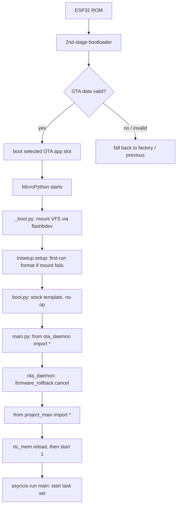

## Boot sequence

- The bootloader validates the appended image SHA-256 and the OTA-data partition,
  then jumps into the selected app slot. Failed or rolled-back updates land on the
  previous good slot (see [OTA](/subsystems/ota)).
- `_boot.py` mounts `bdev` at `/` through `flashbdev.py`, and on `OSError` falls back to
  `inisetup.setup()`, which formats LittleFS2 and writes `boot.py` and `main.py`.
- `boot.py` (a VFS file, distinct from the frozen `_boot.py`) is the unmodified
  MicroPython template and does nothing. Both the frozen `main.py` and the `main.py`
  `inisetup` writes to the VFS contain the same three lines.
- `main.py` is, in its entirety, `try: from ota_daemon import *` / `except ImportError: pass`.
- `ota_daemon.py` calls `f_lib.firmware_rollback.cancel()` — marking the running slot
  valid and cancelling rollback — then does `from project_main import *` inside a `try`
  that prints `Project Exception Occurred` and a traceback on failure.
- Importing `project_main` runs its module body, which calls `disable_ble()`,
  `rtc_mem.reload()`, and then **`start(1)`**. Everything after that is the application:
  event bus, task manager, LEDs, radios, GNSS, and the compass state machine. In v5.0.3
  `compass.start` launches the ESP-NOW comms task via `enow_v2.communicate_supervised`,
  which restarts it on a crash (v5.0.2: `communicate_v2` directly).

### `project_main.start(cmd, opt)` *(CONFIRMED)*

Before dispatching on `cmd`, `start` drains the RTC category-0 mailbox: if a frame is
present it takes `cmd_id = frame[3]`, deletes the frame, and for `cmd_id in (1, 2)` runs
`asyncio.run(svc_ble_transfer.svc_manager(cmd_id=cmd_id))` — this is how a BLE command
reboots the device into the transfer service (see [module reference](/reference/modules)).

| `cmd` | Path |
| --- | --- |
| **1** | **The only mode production reaches.** If the reset cause is `SOFT_RESET` (5): `perform.ota` on the VFS → `perform_ota()`; `upload.log` → `upload_logs()`; `debug.mode` → apply its `lvl` to the logger, then delete it. Then `asyncio.run(main())` |
| 2 | `Pin(4, Pin.IN, Pin.PULL_UP)`, then `mpy_dev.dev_comms.start(opt)` |
| 3 | `demi_god.start(**opt)` |
| 4 | `mpy_dev.dev_imu.start(opt)` |
| 5 | `mpy_dev.dev_leds.start(opt)` |
| 8 | `web_bluetooth.start(**opt)` |
| 9 | `mpy_dev.dev_rest.start(opt)` |
| 11 | `mpy_dev.dev_mem_release.start(opt)` |

<Note>
  Modes 2, 4, 5, 8, 9 and 11 import `mpy_dev.*` or `web_bluetooth`, **none of which is
  frozen into the image or present on the VFS**. They raise `ImportError` on a production
  device. They are reachable only by calling `start(n)` by hand from the REPL, because the
  module body hard-codes `start(1)`.
</Note>

## Power / boot modes

`device_power.py` tracks an application-level `boot_mode` and a battery-health state. Observed
states and transitions (from log strings and symbols):

| Concept | Values / evidence |
| --- | --- |
| App `boot_mode` | `BOOT_POWER_ON`, `BOOT_SHUTDOWN` — app-level values, distinct from the ESP reset cause below |
| Desired boot mode | `Power Control \| Desired boot_mode: {}` |
| Power mode | app aliases `PM_PERF` / `PM_PWRSAVE` mapped to the ESP32 esp_pm tiers `PM_PERFORMANCE` / `PM_POWERSAVE`, with `is_power_perf` / `is_power_constant` / `is_power_down` / `is_powered` state flags; switch logged as `Changing power mode from {} to: {}`. Numeric enum ids are not string-extractable. |
| Eco / idle profile | timed low-activity profile (`eco_mode_sec`, `is_eco_mode`, `evt_idle`) plus a peripheral power gate (`pwr_gate_pin`) |
| Battery health | `Changing battery health to: {}`; confirmed health signals are the events `evt_battery_charged` and `evt_battery_usable` (the full enum is not string-extractable). Low battery first locks out features (`Battery too low for BLE`, `Battery too low for OTA update`) before the hard low-voltage cutoff. |
| Low-voltage cutoff | `Voltages too low, powering down \| {}v` |

### Reset cause vs. boot-loop protection

The app `boot_mode` above is separate from the hardware **reset cause** the ESP reports
(`Reset Cause: {}` — e.g. `WDT_RESET`, `DEEPSLEEP_RESET`). A boot-failure / crash-counter
mechanism guards against boot loops: it tracks `boot_count`, `boots_failed`
(with `boots_failed_max` / `boots_failed_min`) and `boots_wdt`, and on a bad boot runs a WDT
recovery path (`check_bootsec`, `calc_recovery_risk`, `check_recovery_cache`,
`Performing immediate WDT Recovery`) before rebooting (`Rebooting from: {} in 3sec`,
`Is Reboot a Continued Session: {}`).

### Remote power control (demigod)

Power state can be commanded remotely over the mesh. A peer can send a **demigod** power-control
command (`Power control demigod command received`, `demigod_gen_pwr_control`) that changes the
power mode or triggers power-down (`Sending demigod command to power down`), subject to a
qualification gate (`Device disqualified from demigod command`).

## Sleep and power-down

<Warning>
  **This firmware never deep-sleeps.** *(CONFIRMED)* Searching all 94 disassembled modules
  for `deepsleep` returns exactly one hit, and it is inside a string constant in
  `inisetup.dis` — the stock MicroPython `boot.py` template text (`"...including wake-boot
  from deepsleep"`) that `setup()` writes to the VFS. There is no `machine.deepsleep()`
  call anywhere in the image.

  An earlier revision of this page described a deep-sleep state with RTC-memory
  persistence and an `Awake from Deep Sleep` wake line. The log string is real, but see
  the note below — it is not on a path production firmware takes.
</Warning>

<CardGroup cols={2}>
  <Card title="Light sleep" icon="moon">
    Real and heavily used. `espnow_conn_v2.py` imports `machine.lightsleep` and duty-cycles
    the radio around it, tracking `lightsleep_ms` / `dev_total_lightsleep_ms`:
    `Awoke from lightsleep | Slept for: {} of {} | Total Sleep: {} | sleep duty: {:.3f}`.
    Sleep is skipped when the radio is due on (`Not sleeping due radio needing to turn on
    soon`), for GNSS RTC sync (`Block sleep for GNSS RTC Sync`), and after invalid traffic
    (`Lightsleep skipped due to invalid messages`).
  </Card>
  <Card title="Power-down" icon="power-off">
    Not sleep — `device_power.shut_down_tasks(method)` either cuts hardware power or
    resets the chip. See the table below.
  </Card>
</CardGroup>

### `device_power.shut_down_tasks(method, is_save_config)` *(CONFIRMED)*

The single power-down path. It sets the `BOOT_SHUTDOWN` watchdog condition, optionally
bumps the boot counters and persists config, saves BLE secrets unless `method == 2`,
tears down the task set (`tasks.cleanup()`, then `tasks.stop(...)` over thirteen named
tasks — `compassing.start`, `sound_react`, `start_comms`, `enow_recv`, `gnss_stream`,
`imu_fusion`, `monitor_battery`, `low_battery`, `esp_comms`, `backend_checks`,
`gnss_debug_printout`, `stream_gnss_msgs`, `debug_active`), awaits
`enow_v2.power_off(force=True)`, and then:

| `method` | Action |
| --- | --- |
| **0** | `Pin(4, Pin.OUT, Pin.PULL_UP).off()` — drives GPIO4 low, releasing an **external hardware power gate**. This is the real "off" |
| **1** | `machine.reset()` — hard reset |
| **2** | `machine.soft_reset()` — soft reset. Used for the reboot-into-service handoff and after staging an OTA |

For methods 1 and 2 the LEDs are turned off first (`leds.crystal.off()`,
`leds.ring.off()`, then a 100 ms pause) unless `modes.is_silent_reboot` is set.

<Note>
  **About `Awake from Deep Sleep | {} | Free mem: {}`.** The string exists, in
  `project_main.dis`. It sits in the `cmd == 2` branch of `project_main.start`, guarded by
  a reset-cause check against `DEEPSLEEP_RESET` (4), and the branch continues into
  `from mpy_dev.dev_comms import start` — a module that is not in the image. Since the
  module body hard-codes `start(1)`, production firmware never enters that branch, and it
  would `ImportError` if it did. A `DEEPSLEEP_RESET` cause is something the ESP can
  *report*; it is not evidence that this firmware ever calls `machine.deepsleep()`.
</Note>

### What RTC memory actually holds

`f_lib/rtc_mem.py` is the allocator, and it survives resets, not sleep. It carries three
categories: a reboot-into-service command, a mirror of the BLE pairing secrets
(`ble_keys.bin`), and a 7-byte device-state snapshot. The frame format and all three
category ids are documented on the [module reference](/reference/modules). `f_lib/rtc_v2.py`
is unrelated — it is a `machine.RTC` subclass providing calendar maths.

The navigation values `snapshot_coords` / `snapshot_ticks` / `snapshot_travel` and the
`is_rtc_snapshot` flag live on the `project_data` config object; only the two flag bits
described in the module reference are written into RTC memory.

Touch sensitivity adapts to the power state — `[touch] Low battery mode ON/OFF` adjusts
the capacitive baseline so the Touch Crystal still works as the battery drains. This
low-battery touch state (constant `BATT_POOR_TOUCH`) is part of the touch subsystem, not a
value of the battery-health enum above.

## Watchdog

`wdt_manager.py` is not a plain task-WDT wrapper but a condition/blocker engine
(`WdtManager` / `WdtConditions` / `WdtBlockers`): an async feed loop (`Starting WDT feed loop`)
feeds the native task watchdog (`mpy_machine_wdt` / `task_wdt`), and is disabled while any
condition or blocker is active — `_should_enable` returns False (`[WDT {}] cond=[{}] blk=[{}]`).
The v5.0.3 blockers are `('log rotate', 'vfs write', 'wlan kick')`; `WLAN_KICK = 2` is new,
set and cleared by `ble_manager` around its WiFi-driver "kick" (v5.0.2 had only the first
two). It supports dynamic threshold changes
(`Updating WDT threshold from: {} to {}`) and drives a recovery/reboot path
(`Performing immediate WDT Recovery`, `restore_wdt_reboot`) that ties into the boot-failure
counters above.

A separate BLE handoff watchdog (`ble_handoff_watchdog`, `[BLE Watchdog] Handoff stall detected`)
arbitrates BLE TX-priority ownership between the phone app and the ESP
(`last_handoff_to_app` / `last_handoff_to_esp`); when a handoff stalls it reclaims TX priority.
