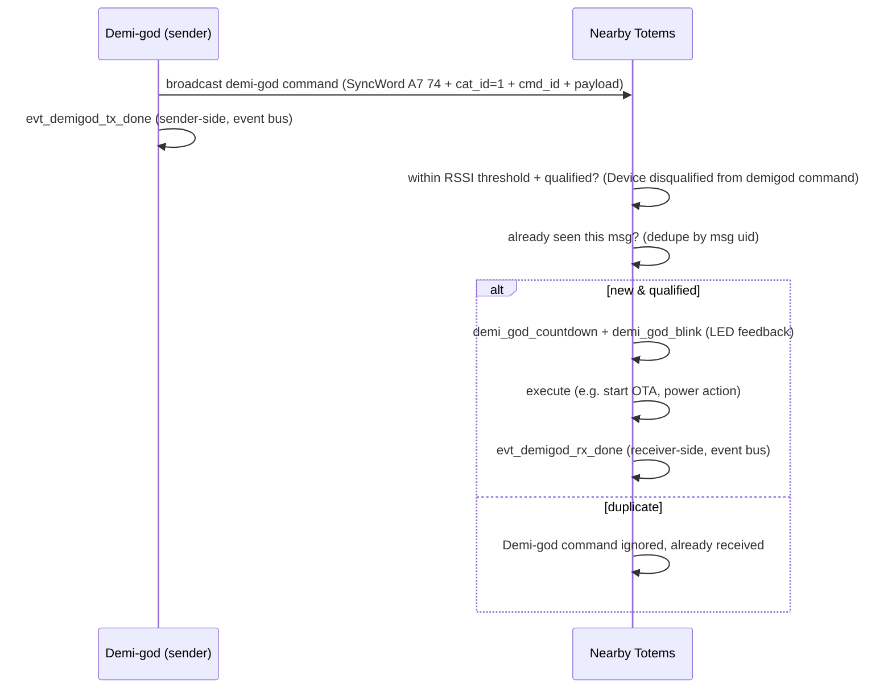

`demi_god.py` implements a **privileged broadcast command system**: a special sender
(a "demi-god") issues commands that nearby Totems act on. It rides ESP-NOW broadcast,
so it reaches every device in range without bonding — the mechanism behind
fleet operations like updating "nearby devices" at a venue.

The sender side is a designated/enabled **"demi daemon"** device role
(`is_demi_daemon`, `enable_demi_daemon`) whose send API is `demi_daemon_send` /
`send_demi_msg` — so originating these privileged commands is itself a gated device role.

## Command set

A generic builder `gen_demi_god(cmd_id, …)` (a `msgr` method in `espnow_conn_v2`) writes a
4-byte frame header — **SyncWord** `A7 74` (`b'\xa7\x74'`) + **`cat_id` = 1** (demigod's
ESP-NOW category) + the caller-supplied **`cmd_id`** — then dispatches by `cmd_id` to one of
five `demigod_gen_*` payload packers (in `espnow_msg`), each of which `struct.pack_into`s its
fields starting at frame offset 4. Every message requires a command id
(`A cmd_id must be provided for demi-god messages`).

The `cat_id` / `cmd_id` values **are** recovered from the frozen bytecode — the `cmd_id ==`
dispatch branches in `gen_demi_god` and the leading `<BB` of each `TOTEM_MSG_MAP` entry.
Demigod is `cat_id = 1`, and the per-command `cmd_id` and wire format are:

| Generator | `cmd_id` | (cat, cmd) | Frame format after SyncWord | Effect |
| --- | --- | --- | --- | --- |
| `demigod_gen_ota_update` | 0 | (1, 0) | `<BBB7bHbb` | tell nearby devices to update firmware (`Demigod to update nearby devices`) |
| `demigod_gen_add_nav_log_rule` | 2 | (1, 2) | `<BBiffHii` | push a navigation-logging rule to devices |
| `demigod_gen_find_device` | 5 | (1, 5) | `<BB9B8bhh4B` | make a target device identify itself (locate) |
| `demigod_gen_pwr_control` | 6 | (1, 6) | `<BBbb9BBB3i` (extended schema 29; base schema 5 = `<BBbbB`) | power control: power off (`send_pwr_off_cmd`, `Sending demigod command to power down`), reboot (`device_reboot`), or power-mode change (`Changing power mode from {} to: {}`) |
| `demigod_gen_venu_code` | 7 | (1, 7) | `<3Bbb` | set a venue / event code |

The **Frame format after SyncWord** column is the `struct` format applied at `frame[2:]`
(`cat_id`, `cmd_id`, then payload) — identical to the receiver's `TOTEM_MSG_MAP[(cat, cmd)]`
entry. `send_msg` broadcasts to the all-ones MAC `FF:FF:FF:FF:FF:FF` (`manager` adds it as a
peer), repeated `send_count` (default 10) times at 200 ms spacing.

`demi_god.py` is byte-identical between v5.0.2 and v5.0.3, but the ESP-NOW transport under
it changed: in v5.0.3 `send_now` (reached via `enow_v2.broadcast` → `send`) drops a send
locally, counting it as `tx_skipped`, when the estimated free driver TX buffers
(`_tx_free()`) are ≤ 0. Under TX back-pressure an individual repetition of a demi-god
broadcast can therefore be skipped (each of the `send_count` repetitions goes through this
check on its own).

## Lifecycle

| Symbol / log | Role |
| --- | --- |
| `demi_god_countdown`, `demi_god_blink` | LED countdown + blink so the user sees a command land |
| `Device disqualified from demigod command` | qualification/eligibility gate; (inferred) keyed on RSSI proximity — a device acts on / adopts a command only when the sender is within an RSSI threshold (`Venue Code Skipped, RSSI outside threshold: {} to {}`, `Mesh skipped, RSSI outside threshold: {} to {}`; qstrs `PEER_CHECK_RSSI`, `closest_rssi`), which also bounds which nearby devices a command can affect |
| `Demi-god command ignored, already received` | replay/duplicate suppression via message uid |
| `evt_demigod_tx_done`, `evt_demigod_rx_done` | **local** completion events on the event bus — `evt_demigod_tx_done` fires sender-side, `evt_demigod_rx_done` receiver-side (not a network ack/reply) |

## Security considerations (observations)

<Warning>
These are analyst observations from static strings, **not** verified vulnerabilities. No
device was tested.
</Warning>

- The channel is **broadcast**, which ESP-NOW does **not** encrypt
  (`Do not support encryption for multicast address`). Any authentication of demi-god
  commands must therefore be **in the application payload**, not provided by the radio.
- Commands are powerful (mass OTA, power-off, locate). The only message validation
  evidenced is a fixed **SyncWord + length** check
  (`Invalid ESP-NOW message SyncWord or length`) — SyncWord match plus `len >= 4` plus a
  per-`(cat,cmd)` payload-size check. There is **no CRC or checksum** on the ESP-NOW /
  demi-god frame; the `Invalid Checksum value for: {}` string belongs to the u-blox UBX
  GNSS parser (a Fletcher-8 CK_A/CK_B check near `calc_ubx_checksum` / `parse_ubx`), not
  this path. The SyncWord is the fixed value `A7 74` (`b'\xa7\x74'`) shared by **all**
  ESP-NOW frames — peer, mesh, and demigod alike — a public framing marker, not a secret. An
  exhaustive negative search found **no** signature / HMAC / nonce / challenge / token
  string tied to demigod or the ESP-NOW app path (the only such strings belong to the
  TLS/mbedTLS stack, BLE bonding, and the WiFi driver). So the string/symbol evidence
  indicates demi-god commands are **unauthenticated at the application layer**; the
  RSSI-proximity gate and replay suppression are the visible safeguards, and neither
  authenticates the sender. The wire layout is now decoded (see the frame-format table
  above): a 4-byte `SyncWord + cat_id + cmd_id` header followed by a per-command `struct`
  payload, with no authentication field.
- The `venu_code` command distributes a plaintext grouping/identifier value to co-located
  devices (adopted only when the sender is within the RSSI threshold —
  `Venue Code Skipped, RSSI outside threshold: {} to {}`), used to scope subsequent mesh / smart-group behavior.
  It is a **grouping token, not a credential** — it carries no key material and does not
  authenticate demi-god authority.

This is the single most security-relevant part of the 2.4 GHz surface and the clearest
candidate for follow-up bytecode analysis.
