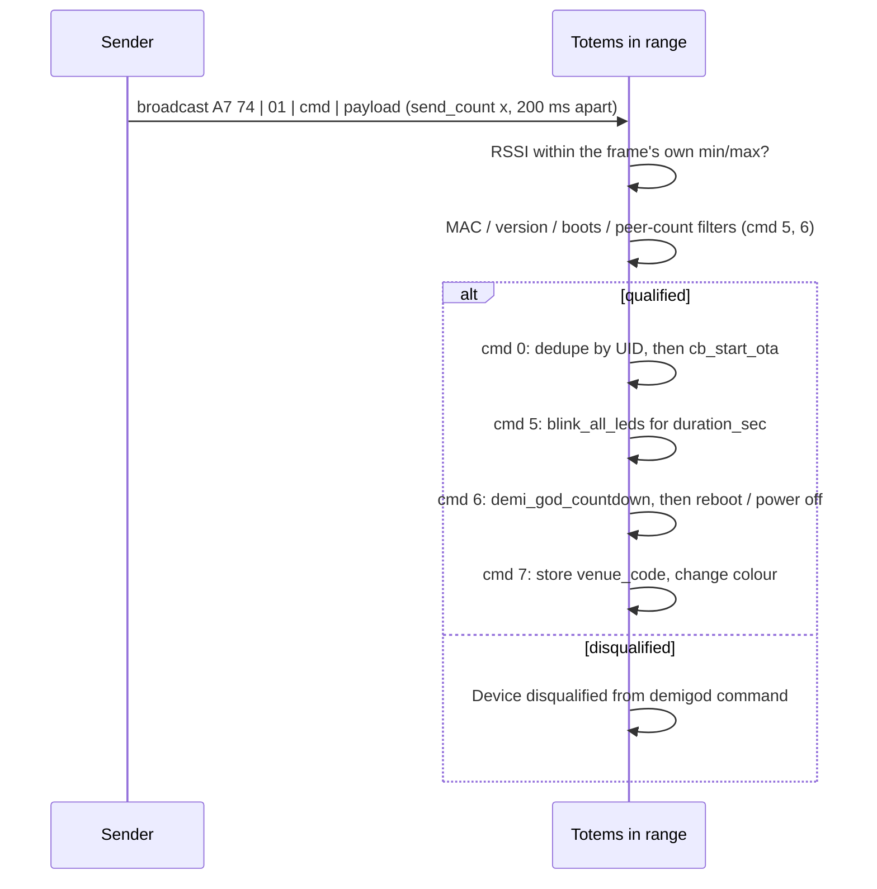

Category 1 is a **broadcast command channel**: one Totem sends, and every Totem in range
that matches the command's filters acts on it. It rides ESP-NOW broadcast, so it needs no
bonding. Three modules are involved: `espnow_conn_v2.Messages.gen_demi_god` builds the
frame, `espnow_msg.demigod_gen_*` packs the payload, and `espnow_conn_v2.Parser._demi_god`
receives it.

## Who can send one

There is no key and no role check on the wire — "demi-god" is a name for the sender side,
not a credential (see [security](#security-considerations)). Four senders exist in the
image, and only the first is reachable in normal use. All rows **Confirmed**.

| Sender | Reachable in normal use? | What it sends |
| --- | --- | --- |
| `ble_manager.update_nearby_devices`, launched as the `update_nearby` task when the **phone** writes `(2,5)` (`Demigod to update nearby devices`, `ble_manager.dis:2200-2215`) | **yes** | `(1,0)` with `ota_cmd=3`, the owner's `user_cfg.wifi_ssid` / `wifi_key`, `save_network=1`, `security_algo=1`, `max_retries=2`, `rssi_min=-30` (`ble_manager.dis:7048-7112`) |
| `project_main.start(cmd=3, opt=…)` → `demi_god.start(**opt)` → `manager` → `send_msg` | service boot only — `cmd` comes from `rtc_mem`, not from the UI (`project_main.dis:1328`) | any `cmd_id`; `send_count` (default 10) broadcasts 200 ms apart |
| `Compass.enable_demi_daemon`, which re-binds the SOS switch | **no** — `Compass.is_demi_daemon` is the literal `False` in `Compass.__init__` and nothing else ever writes it (`compass.dis:1301`, the only `STORE_ATTR is_demi_daemon`) | double-tap `(1,6)` `boot_mode=1`, triple-tap `(1,6)` `boot_mode=3`, single-tap `(1,5)` `boots_failed_min=1, duration_sec=30, r=255`, all `rssi_min=-99` |
| `Compass.send_pwr_off_cmd` | **no** — defined at `compass.dis:7975` and never called; `send_pwr_off_cmd` appears nowhere as a `LOAD_ATTR`/`LOAD_METHOD` | `(1,6)` `boot_mode=3, rssi_min=-99, delay_sec=1`, as a 300 ms `send_burst` for 6 s plus two queued singles (`Sending demigod command to power down`) |

<Note>
Earlier versions of this page said the sender was a gated "demi daemon" role with a
`demi_daemon_send` API, and that `send_pwr_off_cmd` was how power-off was issued. Both are
wrong. `demi_daemon_send` is an **LED task name** (`compass.dis:3950`), `enable_demi_daemon`
is dead code behind a hardcoded `False`, `send_pwr_off_cmd` has no caller, and `demi_god.py`
itself contains only `send_msg`, `manager` and `start` — its qstr table has no
`is_demi_daemon`, `enable_demi_daemon` or `demi_daemon_send` at all. In 5.0.3 the phone's
"update nearby devices" button is the one demi-god command a user can actually cause.
</Note>

`manager` requires a command id (`A cmd_id must be provided for demi-god messages`), turns
the LEDs over to itself (`evt_led_override_off.clear()`, crystal hot pink), optionally
resets the radio and re-adds `FF:FF:FF:FF:FF:FF` as an ESP-NOW peer, then broadcasts and
restores the LEDs. The BLE path passes `reset_comms=False`, so it skips the radio reset.
**Confirmed** (`demi_god.dis`, `manager` / `send_msg`).

## Frame layout

`gen_demi_god` allocates `bytearray(4)` and writes **SyncWord** `A7 74` + `cat_id = 1` +
the caller's `cmd_id`, then calls one `espnow_msg.demigod_gen_*` packer. Each packer first
`extend`s the buffer with zero bytes and then `struct.pack_into`s from frame offset 4, so
**the frame a Totem transmits is longer than the receiver's `TOTEM_MSG_MAP` entry** — the
tail is zero padding (and, for `(1,0)`, variable-length strings). All **Confirmed** from
`espnow_msg.dis`.

The receiver's format is unpacked from `frame[2:]`, so its leading `BB` is the echoed
`(cat_id, cmd_id)` and a `calcsize` of *n* covers frame bytes 2 through *n*+1.

| `cmd_id` | Generator | Frame bytes built | Receiver's format | `calcsize` |
| --- | --- | --- | --- | --- |
| 0 | `demigod_gen_ota_update` | 16 + the strings (+1) | `<BBB7bHbb` | 14 |
| 2 | `demigod_gen_add_nav_log_rule` | 30 | `<BBiffHii` | 24 |
| 5 | `demigod_gen_find_device` | 29 | `<BB9B8bhh4B` | 27 |
| 6 | `demigod_gen_pwr_control` | 29 | `<BBbb9BBB3i`; short form `<BBbbB` | 27; 5 |
| 7 | `demigod_gen_venu_code` | 12 | `<3Bbb` | 5 |

<Note>
The `EXTENDED` keys are **total frame lengths**, not schema ids: `Parser.aread` looks up
`EXTENDED[(1,6)][len(frame)]`, which is why a `(1,6)` frame is decoded with the long format
only when it is exactly 29 bytes. An earlier version of this page called 29 and 5 "schema
ids"; they are byte counts.

The other `EXTENDED` key for `(1,6)` is **5**, and it is unreachable. Every other key in the
table is `calcsize(fmt) + 2` (25→23, 59→57, 72→69, 29→27, 45→43), but `<BBbbB` also has
`calcsize` 5, so the short form would need a **7**-byte frame; a 5-byte one makes
`struct.unpack` raise. `demigod_gen_pwr_control` always builds 29 bytes, so no Totem emits
either length. **Confirmed** from the `EXTENDED` literal (`espnow_conn_v2.dis:916-923`).
</Note>

### `(1,0)` firmware update

`buff.extend(bytes(12))`, then `struct.pack_into('<B7bHbb', buff, 4, …)`, then the four
strings back to back from offset 16, then an optional `endpoint_id` byte appended last.
**Confirmed** (`espnow_msg.dis`, `demigod_gen_ota_update`).

| Offset | Code | Field | Default when the caller omits it |
| --- | --- | --- | --- |
| 4 | `B` | `security_algo` | 0 |
| 5 | `b` | `rssi_min` | `BONDING_RSSI` = −25 |
| 6 | `b` | `save_network` | 0 |
| 7 | `b` | `ota_cmd` | −1 |
| 8 | `b` | WiFi SSID length | 0 |
| 9 | `b` | WiFi key length | 0 |
| 10 | `b` | branch length | 0 |
| 11 | `b` | version length | 0 |
| 12 | `H` | message UID | `randint(1, 65534)` |
| 14 | `b` | `orientation` | 2 — packed, never read by the receiver |
| 15 | `b` | `max_retries` | 0 |
| 16 | *n* bytes | WiFi SSID, WiFi key, branch, version, in that order | — |
| last | `B` | `endpoint_id` | present only if the caller passed one |

`security_algo == 1` means the SSID and key were passed through `f_lib.helpers.rot13`
before packing, and the receiver runs `convert_to_str(..., security_algo=frame[4])` to undo
it. Branch and version are always plain. ROT13 is a substitution, not encryption — the
credentials are recoverable from the frame by anyone. **Confirmed** (`espnow_msg.dis`
`demigod_gen_ota_update`; `espnow_conn_v2.dis:8408-8480` `_demi_god`).

### `(1,2)` navigation-logging rule

`<iffHii` at offset 4: `rule_id`, `latitude`, `longitude`, `radius` (`H`), `nbt`, `eat`
(both `i`). The packer returns `False` — and `gen_demi_god` then returns `False` — when
latitude, longitude, radius, `nbt` and `eat` are all falsy. **The receiver does nothing
with this command**: `Parser._demi_god`'s `cmd == 2` branch jumps straight to the end of the
function. **Confirmed** (`espnow_conn_v2.dis:8613-8617`).

### `(1,5)` find device

`buff.extend(bytes(25))`, then `<6B` at 4 (target MAC) and `<3B8bhh4B` at 10.
**Confirmed** (`espnow_msg.dis`, `demigod_gen_find_device`).

| Offset | Code | Field | Default |
| --- | --- | --- | --- |
| 4 | `6B` | target MAC (`unhexlify`) | `000000000000` = any device |
| 10–12 | `3B` | release major, minor, patch | 0, 0, 0 = any version |
| 13 | `b` | `min_rssi` | −100 |
| 14 | `b` | `max_rssi` | 0 |
| 15 | `b` | `boots_min` | −1 (no filter) |
| 16 | `b` | `boots_max` | −1 |
| 17 | `b` | `boots_failed_min` | −1 |
| 18 | `b` | `boots_failed_max` | −1 |
| 19 | `b` | `peer_count_min` | −1 |
| 20 | `b` | `peer_count_max` | −1 |
| 21 | `h` | `age_min` | −1 — packed, never read |
| 23 | `h` | `age_max` | −1 — packed, never read |
| 25 | `B` | `duration_sec` | 60 |
| 26–28 | `3B` | r, g, b | 255, 255, 255 |

This is a **filtered broadcast**, not an address: every receiver tests itself against the
filters and, if it matches, blinks all its LEDs in the given colour for `duration_sec`
(`tasks.launch(blink_all_leds, task_name='demi_god_blink', …)`). A device that fails any
filter logs `Device disqualified from demigod command`.

### `(1,6)` power control

`buff.extend(bytes(25))`, then `<bb5B` at 4, `<6B` at 11 and `<3i` at 17. **Confirmed**
(`espnow_msg.dis`, `demigod_gen_pwr_control`).

| Offset | Code | Field | Default |
| --- | --- | --- | --- |
| 4 | `b` | `boot_mode` | 0 |
| 5 | `b` | `rssi_min` | −30 |
| 6 | `B` | `delay_sec` | 10 |
| 7 | `B` | 0 | literal, never read |
| 8–10 | `3B` | release major, minor, patch | 0, 0, 0 = any version |
| 11 | `6B` | target MAC | `000000000000` = any device |
| 17 | `i` | `sleep_ms` | 0 — packed, never read |
| 21 | `i` | `wake_interval_ms` | −1 — packed, never read |
| 25 | `i` | `wake_duration_ms` | −1 — packed, never read |

`boot_mode` reaches `Compass.power_control`, which maps **1 → `device_reboot()`,
2 → `device_reboot(is_soft_reboot=True)`, 3 → `device_off()`** and ignores everything else
(`compass.dis`, `power_control`; log `Power Control | Desired boot_mode: {}`). **Confirmed.**

<Note>
An earlier version of this page listed "power-mode change
(`Changing power mode from {} to: {}`)" as a `(1,6)` effect. That log belongs to
`Compass.change_power_mode`, the local eco/normal toggle, which nothing in the demi-god path
calls. `(1,6)` only reboots, soft-reboots or powers off.
</Note>

### `(1,7)` venue code

`buff.extend(bytes(8))`, then `<Bbb` at offset 4: `venue_code` (`B`, default 0),
`rssi_min` (`b`, default −100), `rssi_max` (`b`, default 0). The remaining five bytes stay
zero. **Confirmed** (`espnow_msg.dis`, `demigod_gen_venu_code`).

The receiver stores `config.venue_code` and **sets the device's colour** from it:
1 → `color_id` 0, 2 → 1, 3 → 10, 4 → 4, anything else → 12, then
`tasks.launch(compassing.next_color)`. A frame carrying the code the device already has is
a no-op. **Confirmed** (`espnow_conn_v2.dis:9007-9120`).

<Note>
An earlier version of this page said the venue code "scopes subsequent mesh / smart-group
behaviour". It does not: the only readers of `config.venue_code` in the image are this
handler and `nav_logger`, which records it alongside a log entry. Its visible effect on the
mesh is none; its visible effect on the device is the LED colour.
</Note>

## What a receiver checks

`Parser._demi_god` gates **per command** — there is no gate shared by all of category 1.
All rows **Confirmed** from `espnow_conn_v2.dis:8302-9122`.

| Check | `(1,0)` | `(1,5)` | `(1,6)` | `(1,7)` |
| --- | --- | --- | --- | --- |
| RSSI floor from the frame | `rssi ≥ rssi_min` (offset 5) | `min_rssi ≤ rssi ≤ max_rssi` | `rssi ≥ rssi_min` (offset 5) | `rssi_min ≤ rssi ≤ rssi_max` |
| Duplicate suppression | yes — frame UID in `Parser.recent` (`Demi-god command ignored, already received`) | **none** | **none** | only "same code as now" |
| Orientation | ignored while the Totem is **upright** (`evt_orien_vertical`) | — | — | — |
| Target MAC | — | all-zero, or equal to `config.mac` | all-zero, or equal to `config.mac` (long form only) | — |
| Version | skips if `version == syst.release_code` (`Already running desired version, skipping...`) | must match when a major is given | must match unless `0.0.0` | — |
| Other filters | — | `boots`, `boots_failed`, `len(config.peers)` ranges | `boot_mode ≥ 1` | — |
| LED override | — | acts only while `evt_led_override_off` is set | acts only while `evt_led_override_off` is set | — |

The RSSI floor is carried **in the frame**, chosen by the sender. It is not a fixed
threshold on the receiver: the dead `send_pwr_off_cmd` and the dead SOS-switch handlers all
send −99, which any device that can hear the frame at all will pass. The one live sender,
the phone's `(2,5)` button, sends −30.

`evt_demigod_rx_done` is not a network acknowledgement. `(1,6)` awaits it, clears it,
performs the action and sets it again — it is a local re-entrancy latch so two power
commands cannot overlap. `evt_demigod_tx_done` is the same latch on the sender side.
**Confirmed** (`espnow_conn_v2.dis:8947-9005`; `compass.dis`, `daemon_hard_reset`).

## Transmit back-pressure (v5.0.3)

`demi_god.py` is byte-identical between v5.0.2 and v5.0.3, but the transport under it
changed: `send_now` (reached via `enow_v2.broadcast` → `send`) drops a broadcast locally,
counting it as `tx_skipped`, when `_tx_free()` is ≤ 0 — that is, within 2 s of an
`ESP_ERR_ESPNOW_NO_MEM` refusal or when `32 − 4 − pending_tx()` is not positive. Each of the
`send_count` repetitions is checked on its own, so individual repetitions can be skipped
under load. **Confirmed** (`espnow_conn_v2.dis`, `_tx_free` / `send_now`).

## Security considerations

<Warning>
These are observations from the disassembled firmware. No device was tested, and nothing
here is an instruction to transmit these frames: `(1,0)`, `(1,6)` and `(1,7)` change the
firmware, power state and appearance of **other people's** devices.
</Warning>

- The link is unencrypted and unauthenticated. No PMK or LMK is ever programmed
  (see [ESP-NOW mesh](/protocols/espnow-mesh#encryption--there-is-none)), and the
  application payload carries no signature, HMAC, nonce, challenge or token. The SyncWord
  `A7 74` is shared by every ESP-NOW frame the firmware sends — a framing marker, not a
  secret.
- Validation is **SyncWord + `len ≥ 4`** in `EspConn.recv`, then a `(cat, cmd)` lookup and a
  `struct.unpack` over an exactly-sized slice in `Parser.aread` — a minimum-length check, not
  an integrity check. There is no CRC or checksum on the frame. (`Invalid Checksum value
  for: {}` belongs to the u-blox UBX GNSS parser, not this path.)
- The visible safeguards are the frame's own RSSI window, the `(1,0)` duplicate suppression
  and the `(1,0)` upright-device exemption. None of them identifies the sender, and the RSSI
  window is a **sender-chosen field**, so it constrains nothing an author does not want
  constrained.
- `(1,0)` can carry a WiFi SSID and key in the clear, optionally ROT13'd
  (`security_algo = 1`), and `save_network = 1` makes the receiver write them to
  `user-config.json`. This is not hypothetical: it is exactly what the phone's "update
  nearby devices" button sends — the owner's own home WiFi credentials, ROT13'd, broadcast
  to every Totem within −30 dBm, with instructions to save them. ROT13 is a fixed letter
  rotation; it hides the credentials from nobody.
- `(1,5)` lets a sender select devices by boot count, failed-boot count and peer count, so a
  frame can be aimed at, for example, every device in range that has ever failed a boot —
  which is exactly what `daemon_hw_errors` does.
