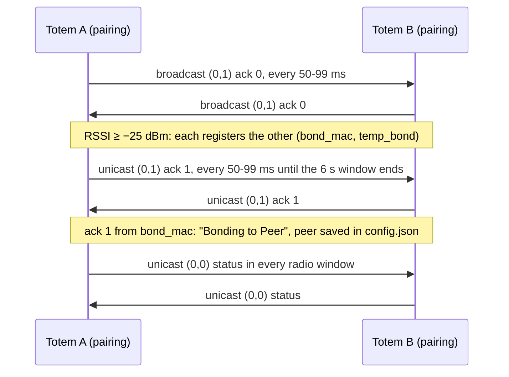

The **Unity Mesh Network** is Totem-to-Totem communication built on **ESP-NOW** —
Espressif's connectionless 2.4 GHz protocol that sends frames directly to a peer MAC
without an access point. Implemented in `espnow.py`, `espnow_conn_v2.py`,
`espnow_msg.py`, `aioespnow.py`, and the `peer_*` modules.

## Why ESP-NOW

- **No infrastructure**: works anywhere, no WiFi network or internet.
- **Low latency, low power**: short frames, radio can sleep between them.
- **Direct + broadcast**: unicast to a bonded peer, or broadcast for discovery and
  [demi-god](/protocols/demigod) commands.

## Application frame

Every ESP-NOW frame — unicast and broadcast alike — begins with a fixed 2-byte
**SyncWord** followed by a category/command header, then a payload whose layout is
selected by the `(cat_id, cmd_id)` pair (see [message format](/protocols/message-format)).

```text
byte   0    1    2      3       4 .. N
      +----+----+------+-------+-----------------------------+
      | A7 | 74 |cat_id|cmd_id | payload (per (cat,cmd) map) |
      +----+----+------+-------+-----------------------------+
       SyncWord  \_____ 2B ____/
```

| Field | Offset | Value | Grade |
| --- | --- | --- | --- |
| SyncWord | `[0:2]` | bytes `0xA7 0x74` (on the wire: `0xA7` then `0x74`) | Confirmed |
| `cat_id` | `[2]` | uint8 category | Confirmed |
| `cmd_id` | `[3]` | uint8 command | Confirmed |
| payload | `[4:]` | struct selected by `(cat_id, cmd_id)` | Confirmed |

**Validation is SyncWord match + length only — there is no CRC or checksum on the ESP-NOW
frame.** A receiver rejects any frame shorter than 4 bytes or not beginning with
`0xA7 0x74`, then validates the payload against the per-`(cat,cmd)` struct size. There is
no in-band length field: the receiver uses the ESP-NOW MAC frame length plus the expected
struct size.

```text
Invalid ESP-NOW message SyncWord or length
```

<Note>
Both `Invalid Checksum value for: {}` and
`Invalid payload size for: {} | expected: {}, received: {} | Total Errs: {} / {}` belong to
the u-blox UBX GNSS parser (`ubx_gnss`, a Fletcher CK_A/CK_B check), **not** the ESP-NOW path
— the only validation log the ESP-NOW module (`espnow_conn_v2`) emits is
`Invalid ESP-NOW message SyncWord or length`. A custom ESP-NOW client computes no checksum —
prepend `0xA7 0x74`, set `cat_id`/`cmd_id`, and append the payload.
</Note>

## Channel

The mesh operates on a fixed **home channel — channel 6** (`self.channel = 6`, hardcoded in
`espnow_conn_v2.__init__`; the only write to `self.channel` in the module — Confirmed). A peer
on a different channel is rejected outright:

```text
Peer channel is not equal to the home channel, send fail!
Peer channel is not support, need to change channel
```

WiFi and BLE coexist with the mesh on this one radio — the firmware exposes combined
run-modes (`MODE_ESP_NOW_WIFI`, `MODE_ESP_NOW_WIFI_BLE`) so ESP-NOW runs alongside them
rather than being switched off. Because every peer must stay on the shared home channel,
any WiFi activity that retunes the radio to another channel (for example a WiFi firmware
download) would interrupt mesh delivery until the radio returns to the home channel.

## Long-range PHY

The mesh always runs on **Espressif Long Range** (`WIFI_PROTOCOL_LR`, protocol bitmap `0x08`,
LR only). `EspConn.check_mode` knows three `(pm, protocol)` pairs, and v5.0.3 only uses the
two LR ones: mode 0 `(PM_NONE, LR)` for ESP-NOW alone, and mode 2 `(PM_PERFORMANCE, LR)`
while BLE is active. Mode 1 (802.11 b/g/n) has no callers. A non-Espressif NIC, or an ESP32
not put into LR mode, therefore **cannot** exchange frames with a Totem: a client must be an
Espressif device configured with `WIFI_PROTOCOL_LR` on channel 6. `power_on` also sets
`txpower=21` (dBm; the driver caps it at 20).

The LR data rate is set on the ESP-NOW object, not via `wlan.config(lorate=...)`:
`EspConn.power_on` and `EspConn.recover` both call `self.e.config(rate=41)`, and 41 = `0x29` =
`WIFI_PHY_RATE_LORA_250K`. v5.0.3's WiFi-kick path re-applies it after restarting the driver.
A client should use **LR 250K** to match. *(PHY and rate: Confirmed in v5.0.2 and v5.0.3, and
on hardware: an ESP32 set up this way bonds with a 5.0.3 Totem, see
[ESP32 emulator](/reference/esp32-emulator). Earlier versions of this page said the IDF
default of 500K applied; that was wrong.)*

## Peers & bonding

"Bonding" here is a **Totem-to-Totem** relationship (distinct from BLE bonding with the
phone). A bonded set of Totems is a friend group that syncs positions.

| Concept | Symbols / logs |
| --- | --- |
| Peer registry | `config.peers` (keyed by the peer's MAC as 12 lowercase hex digits, saved to `config.json`), `peer_management.py`; `add_new_bond` is the phone (BLE) path for adding a peer or point of interest |
| P2P pairing | `start_pairing`, `pair_nearby`, `Register sender as peer to bond to`, `Bonding to Peer`, `Deleting Peer with failed bond: {}` |
| Auto-bond (Smart Group) | `start_smart_group`, `Autobonding to Peers`, `auto_bond_timeout`, `auto_bond_client_timeout`, `Abandoning auto-bond group` |
| Promo bond | `[create_promo_bond] Created Bond!`, `Peer already exists` (a local point of interest, not over the air) |
| Re-bond | `Already a Peer, allow re-bonding`, `Both devices already bonded` |
| Proximity gate | `BONDING_RSSI` = `-25` dBm, `SMART_GROUP_RSSI` = `-45` dBm, `PEER_CHECK_RSSI` = `-3` — Confirmed |
| Saved fields | `_PEER_BLACKLIST`: the volatile `Peer` attributes (`last_msg`, `msg_rx`, `mesh_next_msg`, …) left out of `config.json`, not a list of blocked MACs |
| Limits | ESP-NOW peer table capped at the C-module limits `MAX_TOTAL_PEER_NUM` / `MAX_ENCRYPT_PEER_NUM`; the frozen-Python guard rejects when `len(peers) > modes.max_peers` (9, `Max ESP-NOW peers reached`). Bonds capped by `max_bonds`, default **8** (`Cannot have more than {} bonds`) — Confirmed |

Bonding events drive LED animations: `anim_add_peer`, `anim_bonding_ctdwn`
(countdown), `anim_peer_del_ctdwn`, `add_peer_animation`.

### Pairing (P2P bond)

The normal bond between two Totems is a handshake of **category 0, command 1** peer frames
(the same 108-byte frame as the [peer status](#peer-status-and-radio-windows), see
[message format](/protocols/message-format#peer-frame-0-cmd)). It is **Confirmed** from the
bytecode (`Compass.start_pairing`, `Compass.pair_nearby`, `Parser._peer`) and on hardware.

**Trigger.** A long hold on the Touch Crystal: `Compass.touch_button_cb` maps a short hold
(≥ 360 ms) to `start_bonding_countdown`, a long hold (≥ 1200 ms) to `start_pairing`, and an
extra-long hold (≥ 7200 ms) to `start_smart_group`. The owners of both Totems hold them within
the same few seconds. `start_pairing` refuses while a Smart Group is active or when the Totem
already has `max_bonds` (8) peers, and it opens a **6 s** window (`asyncio.wait_for(pair_nearby(),
6)`).

**Handshake.** While pairing, each Totem runs `pair_nearby`, which every `randrange(50, 100)` ms
sends:

1. a **broadcast** `gen_peer_msg(cmd_id=1, is_ack=0)` (ack byte at offset 18 = 0) until it has
   picked a partner, then
2. a **unicast** `gen_peer_msg(cmd_id=1, is_ack=1)` to that partner.

The receiver (`Parser._peer`) acts on a command-1 frame only while it is pairing itself and
only at **RSSI ≥ `BONDING_RSSI` (−25 dBm)**, i.e. with the two devices practically touching:

| Frame received | Condition | Action |
| --- | --- | --- |
| cmd 1, any ack | not pairing | ignored |
| cmd 1, any ack | RSSI < −25 | `RSSI too poor to bond: {}` |
| cmd 1, any ack | Smart Group heard < 1 s ago | `Skip P2P bonding when auto-bonding` |
| cmd 1, any ack | no partner yet, sender unknown | `Register sender as peer to bond to`: `add_peer(mac)`, new `Peer` (colour, crystal pixel, `mesh_grp`) in `config.peers`, `bond_mac = sender`, `temp_bond = sender` |
| cmd 1, any ack | sender already a peer, heard < 6 s ago | `Both devices already bonded`: **5 unicast ack-1 frames, 80 ms apart**, then `cb_already_bonded` |
| cmd 1, **ack 1** | `bond_mac == sender` | `Bonding to Peer`: bond complete, `temp_bond` cleared, add-peer animation |

When the window closes (`cancel_pairing`), a partner that never sent an ack-1 frame
(`temp_bond` still set) is deleted again: `Deleting Peer with failed bond: {}`. After a
completed first bond with the phone connected, the Totem sends `ble_first_bond_burst`: about 20
status frames, 300 ms apart.



There are no keys and no challenge: the bond is the two entries in `config.peers`, keyed by the
ESP-NOW source MAC (the STA MAC, `machine.unique_id()`). The peer-frame `target_mac` field is
always zero in 5.0.3 and is never read. A `(0,2)` unbond notice is sent to a deleted peer, but
5.0.3 receivers ignore it.

### Smart Group (auto-bond)

A Smart Group bonds a whole group at once. It uses category 7 (see
[message format](/protocols/message-format#smart-group-beacon-70)):

1. The **host** (extra-long hold) picks `smart_grp_uid = randint(1, 65534)` and broadcasts a
   `(7,0)` beacon with instruction **1** every **333 ms** for up to **40 s**. The beacon carries
   the host's position, the group UID, the time left and the member list (MAC + position +
   colour per member). It does not carry RSSI: receivers measure it.
2. A **client** that is pairing and hears a beacon at **RSSI ≥ `SMART_GROUP_RSSI` (−45 dBm)**
   broadcasts a `(7,1)` join (join flag +1) twice, 200 ms apart (`Sent Smart Group join cmd`).
   The host adds it (up to `max_bonds`) and each join extends the window by up to 12 s. A
   client that finds its own MAC in the member list sets `smart_grp_uid` and waits.
3. The host finishes with instruction **3** (shuffled colours) or **−1** (abandon), each as a
   300 ms × 1.6 s burst. On instruction 3, every member runs
   `peer_management.auto_bond_to_peers`, which **deletes all existing peers** and bonds with
   every other member. Wrong-group frames are ignored (`Incorrect auto-bond group, ignore
   request`); since v5.0.3 a `−1` frame also cancels on a UID match alone.

<Warning>
Hosting a Smart Group near other people's Totems can wipe their friend lists: a member that
accepts instruction 3 deletes every peer it had. Only host with Totems you own.
</Warning>

## Encryption — there is none

**All ESP-NOW traffic is cleartext — broadcast *and* unicast.** No PMK is ever
programmed and no LMK is ever set, so the ESP-NOW link layer runs entirely unencrypted.
This is confirmed, not inferred:

- The ROM ESP-NOW C-module exposes `set_pmk`, `lmk`, and `encrypt`, but those qstrs appear
  in **no frozen module's `qstr_table`** — no Python code ever references them.
- `add_peer(mac)` is always called with a single positional argument, so `lmk` defaults to
  `None` and `encrypt` defaults to `False`. The concept of ESP-NOW encryption exists in the
  ROM module but is never used.
- There is also **no application-layer authentication** on the ESP-NOW path — no token,
  HMAC, challenge/response, or signature.

<Warning>
There is no confidentiality or authenticity on the mesh. Any Espressif device on channel 6
in Long-Range mode can read every peer sync, position, and chat message and can inject
valid frames. The only gates are RSSI proximity (for bonding) and msg-UID de-duplication —
neither is a security control.
</Warning>

<Note>
The IDF strings `PMK is NULL`, `set lmk fail`, `Encryption Failed`, and
`Do not support encryption for multicast address` are the ESP-IDF ESP-NOW layer's own
messages; their presence in the image does **not** mean the app uses encryption. The app
never sets a PMK or LMK.
</Note>

## Peer status and radio windows

Bonded Totems keep each other up to date with the **peer status** frame, `(0,0)` from
`gen_peer_msg(cmd_id=0)`: position, heading, SOS, orientation, clock, battery, version and
name (field table in [message format](/protocols/message-format#peer-frame-0-cmd)). It is
**not** a broadcast: `send_now(None, …)` loops over the bonded, non-POI peers and unicasts one
copy to each. An unbonded Totem therefore transmits nothing except while pairing. A second
copy goes out when the furthest peer is more than 30 m away.

`EspConn.communicate_v2` opens a **radio window** once per period and sends the status about
75 ms after it opens (`ping_peers`). With a clock the windows are aligned to the wall clock
(`radio_timer`: the next multiple of the period since the start of the minute), so all
GNSS-synced Totems transmit in the same slots. The period comes from `COMM_SPEED[speed_id]`
= `(mpm, radio_on_ms, …)`:

| speed | When | Period | Radio on |
| --- | --- | --- | --- |
| 1 | upright, clock set | **4 s** | 400 ms per window |
| 2 | as 1, eco mode, no peer in SOS | 4 s | 400 ms |
| 8 | as 1, and a peer lies flat | 1 s | 400 ms |
| 0 | lying flat, battery fine | 1 s | always |
| 5 | lying flat, low battery | 2 s | 400 ms |
| 4 | upright, no clock, has peers | 1 s | always |
| 3 | upright, no clock, no peers | none | off |
| 6 | as 3 or 4 without satellites | 5 s, not aligned | 2.5 s, up to 3 sends at rotating sub-second phases |

No status goes out while the Totem is in the bonding UI (`modes.evt_bonded` is cleared).

**Clock sync.** The status frame carries `itod` (ms since midnight) and the Unix time only
when the sender's clock came from GNSS (`rtc_method == 1`); otherwise both are −1. A Totem
without a clock takes the time from the first such frame (`RTC set via Peer's itod`, not
earlier than 30 s after boot) and then sets `rtc_method = 2`, so it does not pass a borrowed
clock on.

Peer updates can also be pushed to the phone: `Adding Peer: {} to BLE outbox`, and are
ACKed as `BLE ACK Peer Sync` / `BLE ACK Peer Ping`. `(0x06, 0x07)` Peer Sync belongs to that
BLE registry; on the air the peer frames are category 0.

### Transmit back-pressure (v5.0.3)

v5.0.2 sent an all-peer message as one driver call, `e.send(None, msg)`. v5.0.3 changes
`send_now` for all-peer and explicit-MAC sends, and adds a supervisor:

- **All-peer sends** (`mac` None / `'all'`, used by `_send_outbox`) are a **unicast loop** over
  the non-POI peers. Each send goes to at most `_tx_free()` peers, and the start index rotates
  so peers skipped last time go first.
- **Free-buffer estimate:** `_tx_free()` is `32 − 4 − pending_tx()`. It is 0 for 2 s after the
  driver refuses a frame with `ESP_ERR_ESPNOW_NO_MEM`. `pending_tx()` is `tx_pkts − tx_responses`
  from `e.stats()`, relative to a rebased baseline.
- **Dropping sends:** with no free buffers, explicit-MAC and broadcast sends, including
  demi-god broadcasts, are dropped locally (`tx_skipped`).
- **Phantom-pending probe:** `_tx_probe` checks whether a stuck pending count is real. It
  triggers at ≥ 20 pending for 30 s, at most once per 120 s.
- **`NO_MEM` is back-pressure, not a fault.** v5.0.2 logged `ESP_ERR_ESPNOW_NO_MEM` and set
  `is_silent_reboot`. v5.0.3 only records the refusal (`tx_refused`) and backs off.
- **Supervisor:** the comms task now runs under `communicate_supervised`. It restarts
  `communicate_v2` after a `RuntimeError`/`OSError` (`communicate_v2 died; restarting`).
- **WiFi kick coordination:** the task waits out the new BLE-side WiFi driver kick
  (`is_kicking`, `evt_kick_idle`) before light-sleeping or re-activating the WLAN.

### Locate requests & relay

The only multi-hop frame is the 45-byte **locate** frame `(2,0)` from `gen_mesh_msg` (field
table in [message format](/protocols/message-format#locate-20)). It is a flood with
de-duplication, not a routed mesh:

- **Request.** `Compass.one_sec_mesh_coro` wakes 200 ms before each 4-second boundary. In the
  device's own slot (`rtc.sec % 5 == mesh_grp`, `mesh_grp = sha256(mac)[:4] % 5`) and with a
  GNSS fix, it looks for bonded peers that went stale (no position for 2 × `clamp(distance / 75
  m × 60, 60, 600)` s) or are only reachable through the mesh. It then queues a broadcast locate
  request (`is_ack` = 1) for the next radio window. Each stale peer then waits
  `MESH_SEND_FREQ_MS` (30 s) before the next request, and at most 999 requests are sent per
  peer. The requester's `post_comms_check` sends it again with a new UID while nobody relays it
  back.
- **Reply.** A Totem that hears a request from one of its own bonded peers, and has not heard
  that peer directly in the last 60 s, broadcasts its own locate frame (`is_ack` = 0) once,
  plus one repeat with the same UID in a later window. It replies at most once a minute.
- **Relay.** Every Totem with a fix and a clock relays locate frames it has not seen
  (`_relay_frame`): the same bytes, hop count at offset 29 plus one, and its own position
  written over the last-hop coordinates at offset 35. A frame is not relayed at `max_hops`
  (99), after its expiry (origin time + 120 s), or when the relayer is within
  `MESH_RELAY_MIN_DIST` (10 m) of the last hop.
- **Load shedding.** `handle_mesh_msg` drops UIDs already in `parser.recent` (`-5`), frames
  received before the clock is set (`-2`) and, for origins that are not bonded peers, frames
  that arrive while the node is overloaded (`-9`, `-10`), past the ack/relay budgets (`-3`,
  `-4`), from a last hop closer than `relay_min_dist` (`-8`), or outside the node's slots
  (`-6`: `uid % (active_nodes × MESH_SLOTS_PER_NODE)` not in `node_slots`; with fewer than
  6 nearby nodes every frame is relayed).
- **Echo.** An originator that hears its own UID relayed back counts it as honoured (`Relay
  honored by another device. Waiting: {}ms before re-using mesh to find Peer`) and backs off.

A Totem with no GNSS fix ignores the mesh entirely (`recv` drops `(2,0)` frames when
`gnss_data.location` is unset).

The mesh tunables are resolved from the frozen `project_data` module (and the `gen_mesh_msg`
defaults); all Confirmed from the disassembly:

| Constant | Value | Role |
| --- | --- | --- |
| `max_hops` | `99` | max relay hops (default packed into each locate frame) |
| `MESH_SLOTS_PER_NODE` | `6` | relay slots per node |
| `MESH_MIN_HOP_RANGE` | `75` | metres per hop in `cal_mesh_delivery` and the staleness window |
| `MESH_RELAY_MIN_DIST` | `10` | metres; packed into the frame at offset 43 |
| `MESH_SEND_FREQ_MS` | `30000` | per-peer locate request cooldown (ms) |
| `MESH_PEER_MSG_LIMIT` | `999` | locate requests per stale peer |
| `MESH_BUFF_SIZE` | `45` | locate frame size (`ENOW_MESH_BUFF = bytearray(45)`) |
| `MSG_EXP_MSECS` | `150000` | default de-dupe lifetime (ms); `add_recent` keeps a UID for its expiry + 15 s, clamped to 15-400 s |

## What rides the mesh

- **Positions, headings, SOS and battery** of bonded friends: the `(0,0)` status, unicast in
  every radio window, and the `(2,0)` locate flood for friends out of direct range.
- **Clock** from a GNSS-synced peer (`RTC set via Peer's itod`).
- **Bonds**: the `(0,1)` pairing handshake and the `(7,x)` Smart Group.
- **Demi-god broadcast commands** (see next page). The add-nav-log-rule command `(1,2)` is a
  no-op in 5.0.3.

Chat does **not** ride the mesh in 5.0.3: `chat_msg.Messenger` is imported by no module, and
`EspConn.recv` drops `(5,0)` frames. `(3,1)`/`(3,2)` crowd-animation frames have a builder but
no caller and no receiver. `gen_public_chirp`, `advertise_burst`, `add_new_bond` and
`gen_peer_sync` are BLE-side (`ble_manager`) builders, not ESP-NOW frames.
