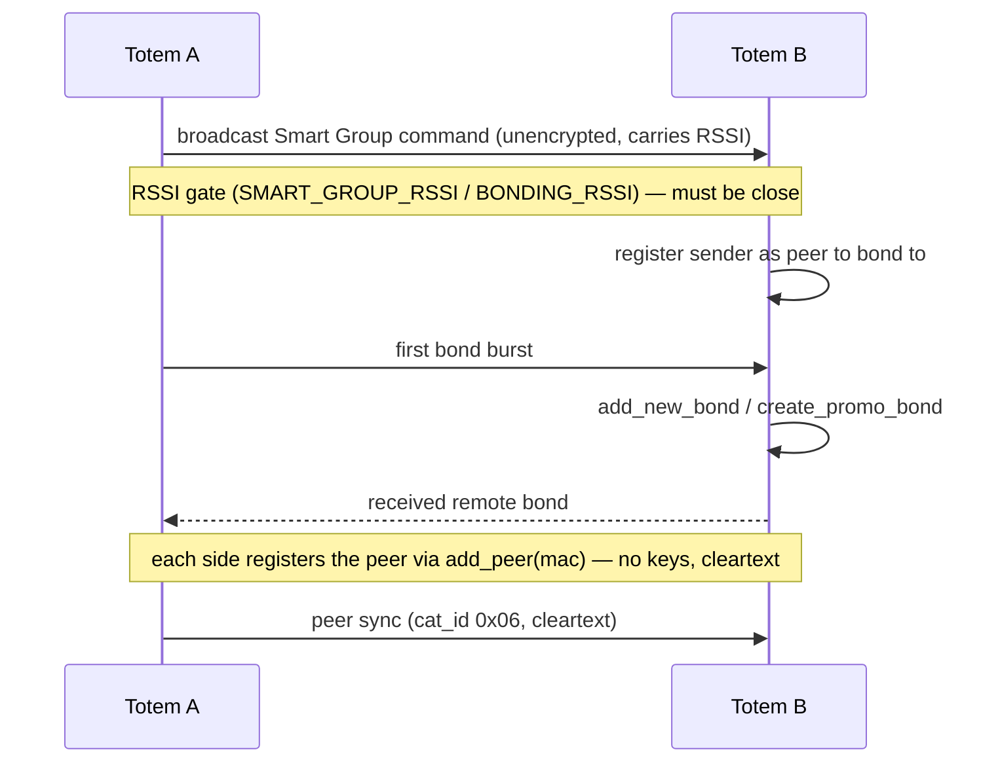

The **Unity Mesh Network** is Totem-to-Totem communication built on **ESP-NOW** —
Espressif's connectionless 2.4 GHz protocol that sends frames directly to a peer MAC
without an access point. Implemented in `espnow.py`, `espnow_conn_v2.py`,
`espnow_msg.py`, `aioespnow.py`, and the `peer_*` modules.

## Why ESP-NOW

- **No infrastructure**: works anywhere, no WiFi network or internet.
- **Low latency, low power**: short frames, radio can sleep between them.
- **Direct + broadcast**: unicast to a bonded peer, or broadcast for discovery and
  [demi-god](/protocols/demigod) commands.

## Application frame

Every ESP-NOW frame — unicast and broadcast alike — begins with a fixed 2-byte
**SyncWord** followed by a category/command header, then a payload whose layout is
selected by the `(cat_id, cmd_id)` pair (see [message format](/protocols/message-format)).

```text
byte   0    1    2      3       4 .. N
      +----+----+------+-------+-----------------------------+
      | A7 | 74 |cat_id|cmd_id | payload (per (cat,cmd) map) |
      +----+----+------+-------+-----------------------------+
       SyncWord  \_____ 2B ____/
```

| Field | Offset | Value | Grade |
| --- | --- | --- | --- |
| SyncWord | `[0:2]` | bytes `0xA7 0x74` (on the wire: `0xA7` then `0x74`) | Confirmed |
| `cat_id` | `[2]` | uint8 category | Confirmed |
| `cmd_id` | `[3]` | uint8 command | Confirmed |
| payload | `[4:]` | struct selected by `(cat_id, cmd_id)` | Confirmed |

**Validation is SyncWord match + length only — there is no CRC or checksum on the ESP-NOW
frame.** A receiver rejects any frame shorter than 4 bytes or not beginning with
`0xA7 0x74`, then validates the payload against the per-`(cat,cmd)` struct size. There is
no in-band length field: the receiver uses the ESP-NOW MAC frame length plus the expected
struct size.

```text
Invalid ESP-NOW message SyncWord or length
```

<Note>
Both `Invalid Checksum value for: {}` and
`Invalid payload size for: {} | expected: {}, received: {} | Total Errs: {} / {}` belong to
the u-blox UBX GNSS parser (`ubx_gnss`, a Fletcher CK_A/CK_B check), **not** the ESP-NOW path
— the only validation log the ESP-NOW module (`espnow_conn_v2`) emits is
`Invalid ESP-NOW message SyncWord or length`. A custom ESP-NOW client computes no checksum —
prepend `0xA7 0x74`, set `cat_id`/`cmd_id`, and append the payload.
</Note>

## Channel

The mesh operates on a fixed **home channel — channel 6** (`self.channel = 6`, hardcoded in
`espnow_conn_v2.__init__`; the only write to `self.channel` in the module — Confirmed). A peer
on a different channel is rejected outright:

```text
Peer channel is not equal to the home channel, send fail!
Peer channel is not support, need to change channel
```

WiFi and BLE coexist with the mesh on this one radio — the firmware exposes combined
run-modes (`MODE_ESP_NOW_WIFI`, `MODE_ESP_NOW_WIFI_BLE`) so ESP-NOW runs alongside them
rather than being switched off. Because every peer must stay on the shared home channel,
any WiFi activity that retunes the radio to another channel (for example a WiFi firmware
download) would interrupt mesh delivery until the radio returns to the home channel.

## Long-range PHY

In the ESP-NOW-only and ESP-NOW+BLE run-modes the radio PHY is **Espressif Long Range**
(`WIFI_PROTOCOL_LR`, protocol bit 8), trading throughput for range across a large venue.
The Wi-Fi-coexist modes (`MODE_ESP_NOW_WIFI`, `MODE_ESP_NOW_WIFI_BLE`) fall back to standard
802.11 B/G/N (protocol bit 7). This means a non-Espressif NIC — or an ESP32 not put into LR
mode — **cannot** exchange frames while the totem runs the common ESP-NOW-only / ESP-NOW+BLE
modes: a client must be an Espressif device configured with `WIFI_PROTOCOL_LR` on channel 6.

The LR data rate is set on the ESP-NOW object, not via `wlan.config(lorate=...)`:
`EspConn.power_on` and `EspConn.recover` both call `self.e.config(rate=41)`, and 41 = `0x29` =
`WIFI_PHY_RATE_LORA_250K`. v5.0.3's WiFi-kick path re-applies it after restarting the driver.
A client should use **LR 250K** to match. *(PHY and rate: Confirmed in v5.0.2 and v5.0.3.
Earlier versions of this page said the IDF default of 500K applied; that was wrong.)*

## Peers & bonding

"Bonding" here is a **Totem-to-Totem** relationship (distinct from BLE bonding with the
phone). A bonded set of Totems is a friend group that syncs positions and messages.

| Concept | Symbols / logs |
| --- | --- |
| Peer registry | `active_nodes`, `add_new_bond`, `peer_management.py` |
| Auto-bond | `Autobonding to Peers`, `auto_bond_timeout`, `auto_bond_client_timeout`, `Abandoning auto-bond group` |
| Promo bond | `[create_promo_bond] Created Bond!`, `Peer already exists` |
| Re-bond | `Already a Peer, allow re-bonding` |
| Proximity gate | `BONDING`; `BONDING_RSSI` = `-25` dBm, `SMART_GROUP_RSSI` = `-45` dBm, `PEER_CHECK_RSSI` = `-3` (bond only when close enough) — Confirmed |
| Blacklist | `_PEER_BLACKLIST` |
| Settle time | `CONN_SETTLE_MS` |
| Limits | ESP-NOW peer table capped at the C-module limits `MAX_TOTAL_PEER_NUM` / `MAX_ENCRYPT_PEER_NUM`; the frozen-Python guard rejects when `len(peers) > modes.max_peers` (`Max ESP-NOW peers reached`). Bonds capped by `max_bonds`, default **8** (`self.max_bonds = 8`; `Cannot have more than {} bonds`) — `max_bonds` value Confirmed |

Bonding events drive LED animations: `anim_add_peer`, `anim_bonding_ctdwn`
(countdown), `anim_peer_del_ctdwn`, `add_peer_animation`.

### Smart Group (auto-bond join)

Auto-bonding uses a broadcast **Smart Group** join protocol. A host broadcasts a Smart
Group command that carries the sender's RSSI; a receiver within `SMART_GROUP_RSSI` (`-45` dBm)
registers the sender as a peer to bond to, then the two sides exchange bond bursts.
Confirmed strings from the send/receive path:

```text
Generating Smart Group msg | inst: {} | timeout: {} | UID: {}
Sent Smart Group join cmd
Received Smart Group Command: {} | Rssi: {} | {}
Register sender as peer to bond to
Sending first bond burst
Received remote bond
```

Wrong-group joins are ignored (`Incorrect auto-bond group, ignore request`). Broadcast
discovery itself rides `gen_public_chirp` / `advertise_burst` (`Created public chirp`).
A cancel frame (`instruction_id == -1`) ends the group. Since v5.0.3 it also does so when only
the group UID matches (not just while `smart_grp_ticks` is set), and it also resets
`auto_bond_timeout` and `client_exit_auto_bond`.

### Bonding flow



If a bond request arrives from a device that is already a peer and was seen within 6 s
(`Both devices already bonded`), v5.0.3 answers it before `cb_already_bonded`. The answer is
five unicast peer ACKs (`gen_peer_msg(cmd_id=1, is_ack=1, is_return=True)`, cat 6) sent 80 ms
apart, so the requester stops retrying.

## Encryption — there is none

**All ESP-NOW traffic is cleartext — broadcast *and* unicast.** No PMK is ever
programmed and no LMK is ever set, so the ESP-NOW link layer runs entirely unencrypted.
This is confirmed, not inferred:

- The ROM ESP-NOW C-module exposes `set_pmk`, `lmk`, and `encrypt`, but those qstrs appear
  in **no frozen module's `qstr_table`** — no Python code ever references them.
- `add_peer(mac)` is always called with a single positional argument, so `lmk` defaults to
  `None` and `encrypt` defaults to `False`. The concept of ESP-NOW encryption exists in the
  ROM module but is never used.
- There is also **no application-layer authentication** on the ESP-NOW path — no token,
  HMAC, challenge/response, or signature.

<Warning>
There is no confidentiality or authenticity on the mesh. Any Espressif device on channel 6
in Long-Range mode can read every peer sync, position, and chat message and can inject
valid frames. The only gates are RSSI proximity (for bonding) and msg-UID de-duplication —
neither is a security control.
</Warning>

<Note>
The IDF strings `PMK is NULL`, `set lmk fail`, `Encryption Failed`, and
`Do not support encryption for multicast address` are the ESP-IDF ESP-NOW layer's own
messages; their presence in the image does **not** mean the app uses encryption. The app
never sets a PMK or LMK.
</Note>

## Peer sync & relay

Once bonded, Totems exchange **Peer Sync** messages — `(0x06, 0x07)` — plus **Peer
Ping** liveness. Delivery is buffered and relayed:

| Symbol | Role |
| --- | --- |
| `enqueue_peer_outbox`, `add_peers_to_outbox` | queue outbound peer messages |
| `_send_outbox` | drain the outbox |
| `_relay_frame` | forward a frame to extend range (multi-hop) |
| `cal_mesh_delivery`, `compass_mesh`, `ENOW_MESH_BUFF`, `MESH_BUFF_SIZE` | mesh delivery + buffering |
| `MESH_PEER_MSG_LIMIT`, `gen_msg_uid`, `MSG_EXP_MSECS` | flood control + de-dupe (see [message format](/protocols/message-format)) |

Peer updates can also be pushed to the phone: `Adding Peer: {} to BLE outbox`, and are
ACKed as `BLE ACK Peer Sync` / `BLE ACK Peer Ping`.

### Transmit back-pressure (v5.0.3)

v5.0.2 sent an all-peer message as one driver call, `e.send(None, msg)`. v5.0.3 changes
`send_now` for all-peer and explicit-MAC sends, and adds a supervisor:

- **All-peer sends** (`mac` None / `'all'`, used by `_send_outbox`) are a **unicast loop** over
  the non-POI peers. Each send goes to at most `_tx_free()` peers, and the start index rotates
  so peers skipped last time go first.
- **Free-buffer estimate:** `_tx_free()` is `32 − 4 − pending_tx()`. It is 0 for 2 s after the
  driver refuses a frame with `ESP_ERR_ESPNOW_NO_MEM`. `pending_tx()` is `tx_pkts − tx_responses`
  from `e.stats()`, relative to a rebased baseline.
- **Dropping sends:** with no free buffers, explicit-MAC and broadcast sends, including
  demi-god broadcasts, are dropped locally (`tx_skipped`).
- **Phantom-pending probe:** `_tx_probe` checks whether a stuck pending count is real. It
  triggers at ≥ 20 pending for 30 s, at most once per 120 s.
- **`NO_MEM` is back-pressure, not a fault.** v5.0.2 logged `ESP_ERR_ESPNOW_NO_MEM` and set
  `is_silent_reboot`. v5.0.3 only records the refusal (`tx_refused`) and backs off.
- **Supervisor:** the comms task now runs under `communicate_supervised`. It restarts
  `communicate_v2` after a `RuntimeError`/`OSError` (`communicate_v2 died; restarting`).
- **WiFi kick coordination:** the task waits out the new BLE-side WiFi driver kick
  (`is_kicking`, `evt_kick_idle`) before light-sleeping or re-activating the WLAN.

### Relay & multi-hop

The Unity Mesh is a **flooding mesh with slotted relay suppression**, not tree routing.
A node re-broadcasts frames it hears (`_relay_frame`) up to `max_hops`, gated by RSSI
distance so it relays for distant peers and suppresses for near ones (`MESH_MIN_HOP_RANGE`,
`MESH_RELAY_MIN_DIST`). Before relaying it waits a randomized slot delay
(`MESH_SLOTS_PER_NODE`, `rand_tail`, `tail_expire_sec`); if it hears another node relay
first it backs off instead of duplicating:

```text
Relay honored by another device. Waiting: {}ms before re-using mesh to find Peer
Node Slots disabled, relaying all (too few nearby nodes)
```

When too few nodes are nearby, slotting is disabled and every frame is relayed. Origin
and relay state is tracked per frame (`origin_mesh`, `originator`, `mesh_honored`,
`mesh_relayed`).

v5.0.3 sheds relay load. `handle_mesh_msg` drops mesh frames whose originator is not a
bonded peer in two cases, and such frames are neither processed nor relayed:

- `-9` (`relay_skip_drop`): the receiver is overloaded (the driver's `rx_dropped` counter grew
  since the last cycle).
- `-10` (`relay_skip_pool`): `load_fps ≥ 4` and at least 8 frames are pending TX.

The mesh tunables are resolved from the frozen `project_data` module (and the `gen_mesh_msg`
default for `max_hops`); all Confirmed from the disassembly:

| Constant | Value | Role |
| --- | --- | --- |
| `max_hops` | `99` | max relay hops (default packed into each mesh frame) |
| `MESH_SLOTS_PER_NODE` | `6` | relay slots per node for randomized backoff |
| `MESH_MIN_HOP_RANGE` | `75` | hop-range gate (RSSI-derived) for relay suppression |
| `MESH_RELAY_MIN_DIST` | `10` | min relay distance packed into the mesh frame |
| `MESH_SEND_FREQ_MS` | `30000` | mesh re-send interval (ms) |
| `MESH_PEER_MSG_LIMIT` | `999` | per-peer mesh message cap (flood control) |
| `MESH_BUFF_SIZE` | `45` | mesh buffer size (`ENOW_MESH_BUFF = bytearray(45)`) |
| `MSG_EXP_MSECS` | `150000` | message lifetime / de-dupe window (ms = 150 s) |

## What rides the mesh

- **Positions & headings** of bonded friends (for the "navigate to friend" feature).
- **Chat messages** (`chat_msg.py`, `chat_inbox_unread`).
- **Peer bond details** (`Downloading Peer Details`).
- **Demi-god broadcast commands** (see next page).
- **Nav-log rules** distributed via demi-god broadcast (`demigod_gen_add_nav_log_rule`).
- **RTC / time-of-day sync** — nodes distribute the clock over the mesh (`RTC set via Peer's itod`, `gen_peer_sync`).
