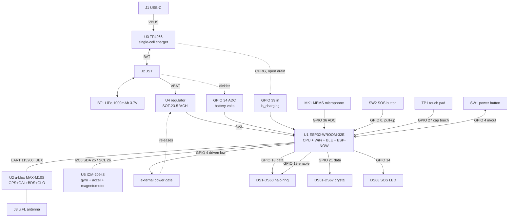

Every other page here was derived from the firmware image. This one starts at the other end:
a **Totem v3.5** opened up and photographed, then matched against the pins the firmware
actually drives. Each net below has a part at one end and a cited line of bytecode at the
other.

<Warning>
  **This is a net-level schematic, not a reverse-engineered one.** It says which parts exist
  and what each MCU pin is connected to. It does not give passive values, series resistors,
  divider ratios or trace routing: those live under the components and on inner layers, and
  no photograph of an assembled board can recover them. Nothing here is guessed to fill a
  gap — where the answer is not known, the page says so.
</Warning>

Confidence markers mean what they do elsewhere in these docs. **Confirmed** additionally
means a part number legible on the silkscreen, or a count taken from the photograph and
matched independently in the bytecode. **Inferred** means the photograph is consistent and
nothing contradicts it.

## Bill of materials

| # | Part | Marking | Role |
| --- | --- | --- | --- |
| U1 | **Espressif ESP32-WROOM-32E** | `ESP32-WROOM-32E`, FCC ID `2AC7Z-ESP32WROOM32E`, IC `21098-ESPWROOM32E`, CMIIT ID `2020DP2713` | Application CPU, WiFi, BLE and ESP-NOW, with its own PCB meander antenna |
| U2 | **u-blox MAX-M10S** | `MAX-M10S`, `u-blox`, silkscreen `GNSS` | GNSS receiver: GPS, Galileo, BeiDou and GLONASS concurrently |
| U3 | **TP4056 LiPo charger** | `4056`, lot `L30B`, SOP-8 | Single-cell linear charger, between J1 and J2, with its programming resistors alongside. The marking is a bare `4056`, so a marking-compatible clone is not excluded |
| U4 | **Regulator (probable)** | `ACH`, SOT-23-5 | Sits in a group of capacitors on the radio side. Package, position and decoupling are those of a 3V3 LDO; a three-letter code is shared across manufacturers, so **no part is claimed** |
| U5 | **InvenSense ICM-20948** | `I2948`, `B23LA1`, `2602` | The 9-axis part: gyroscope, accelerometer **and** magnetometer in one 3x3 mm QFN-24 on the LED side, on I²C bus 0. The firmware names it — `c_icm20948_mag.Icm20948Mag` ([Navigation](/subsystems/navigation)) — and its on-die magnetometer is an AK09916 reached through `imu.mag()`. The marking agrees: `I2948` is TDK's top mark for the ICM-20948, `2602` a 2026 week-2 date code. It is legible only at a grazing angle under flash; head-on the lid looks blank, and an earlier version of this table listed the two views as two parts (`U5`, unmarked, and `U6`, a "SOIC-14" — the QFN's edge pads seen obliquely). **There is no separate magnetometer chip on this board** |
| D? | **Diode** | `A7`, SOD-123 | The standard marking for a 1N4148W small-signal diode |
| Q? | **SOT-23-5** | `J22B` (also read `J2ZB`) | On the LED side beside the IMU; nets untraced |
| — | **Chip resistor** | `124` | 120 kΩ |
| MK1 | **MEMS microphone** | — | Ported can beside the halo. Read as an ADC level, not an audio peripheral |
| DS1…DS60 | **Halo ring** | — | 60 addressable RGB LEDs, WS2812-style, GRB order (**confirmed**). **1.5 x 1.5 mm packages**: measured 1.50 mm wide at a 1.91 mm pitch on an 18.24 mm radius (`hardware/totem-v3.5-reference/measure/`), which a 2 x 2 mm WS2812B-2020 could not fit; castellated pads on the ring's outer and inner edges, as the XL-1515RGBC-WS2812B's |
| DS61…DS67 | **Touch Crystal cluster** | — | 7 more under the moulded light pipe (**confirmed**), mirror-symmetric about the ring's vertical axis around a central spring post: pairs at three heights and one below |
| DS68 | **SOS indicator** | — | A discrete LED on its own pin, not part of either strip |
| SW1 | **Power button** | black cap | Tactile switch. Also the power latch — see below |
| SW2 | **SOS button** | red cap | Tactile switch |
| TP1 | **Touch Crystal pad** | — | Capacitive pad under the light pipe |
| J1 | **USB-C receptacle** | — | Charging only. The board has no USB-UART bridge (the one QFN is the IMU, above) and the ESP32-WROOM-32E has no USB of its own, so no data can reach the module through this port; updates come over Wi-Fi ([OTA](/subsystems/ota)) |
| J2 | **JST battery connector** | — | Two-pin, red and black |
| J3 | **u.FL / IPEX connector** | — | One coaxial pigtail, sitting **directly below U2** with U1 carrying its own PCB antenna. The GNSS antenna |
| BT1 | **LiPo cell** | `805080`, `1000mAh`, `3.7Wh`, `3.7V`, dated `2023.05.18` | Single cell in the housing |
| — | **PCB** | `Totem v3.5`, `hs-pcba.com` | Board revision and contract manufacturer |

## Schematic



## Net list

Every row's pin comes from the firmware and is cited; the destination is what the
photographs show at the other end.

| Net | Pin | Direction | Destination | Source |
| --- | --- | --- | --- | --- |
| `RING_DATA` | **GPIO 18** | out | DS1…DS60 | [LEDs](/subsystems/leds) |
| `RING_EN` | **GPIO 19** | out, pull-up | Halo ring | [LEDs](/subsystems/leds) |
| `CRYSTAL_DATA` | **GPIO 21** | out | DS61…DS67 | [LEDs](/subsystems/leds) |
| `TOUCH` | **GPIO 27** | cap touch | TP1 | [Power](/subsystems/power) — literal confirmed, role inferred |
| `BTN_PWR` / `PWR_LATCH` | **GPIO 4** | in, pull-up; re-opened as out | SW1 and the power gate | [Power](/subsystems/power) |
| `BTN_SOS` | **GPIO 0** | in, pull-up | SW2 | [Power](/subsystems/power) |
| `SOS_LED` | **GPIO 14** | out, pull-down | DS68 | [Power](/subsystems/power) |
| `VBAT_SENSE` | **GPIO 34** | ADC, `ATTN_11DB` | Divider off BT1 | [Power](/subsystems/power) |
| `CHG_PRESENT` | **GPIO 39** | in | A divider off VBUS, not U3's `CHRG` — see below | [Power](/subsystems/power) |
| `MIC` | **GPIO 36** | ADC, `ATTN_11DB` | MK1 | [Power](/subsystems/power) |
| `I2C0_SDA` | **GPIO 25** | bidirectional | U5 | [Navigation](/subsystems/navigation) |
| `I2C0_SCL` | **GPIO 26** | out | U5 | [Navigation](/subsystems/navigation) |
| `GNSS_TX` / `GNSS_RX` | **not recovered** | UART | U2 | [Navigation](/subsystems/navigation) |

The pull-ups named above are the ESP32's **internal** ones, since that is what the firmware
asks for (`Pin.PULL_UP`). Whether external pull-ups are also fitted — on I²C they normally
must be — is not visible.

## Notes on the interesting nets

### GPIO 4 is the power button and the power latch

While the Totem runs, GPIO 4 is an input with a pull-up and reads SW1. To switch off, the
firmware re-opens the *same pin* as an output and drives it low, releasing an external
hardware gate:

```python
Pin(4, Pin.OUT, Pin.PULL_UP).off()
```

That is the real "off" ([Power](/subsystems/power)). Button and latch share one net, so the
board cannot read the button while it is asserting the latch — which is exactly what powering
down means.

### Charging and regulation are separate parts

U3 is a **charger only**: a TP4056 takes VBUS from the USB-C receptacle and charges the cell,
and that is all it does. It does not supply the board. The 3V3 the ESP32 runs on comes from
U4, the SOT-23-5 sitting in its own group of capacitors, fed from the battery rather than
from USB — which is why the Totem runs identically on and off the cable, and why `GPIO 34`
reads the cell rather than the supply.

`GPIO 39` is **not** wired to the TP4056's `CHRG` pin, though that is the first guess and I
made it here before checking. Two facts rule it out:

- `modes.is_charging = self.v_in.value()` ([Power](/subsystems/power)), so the pin reads
  **high** while charging. `CHRG` is open-drain and pulls **low** while charging. The
  polarity is backwards.
- GPIO 34–39 on the ESP32 are input-only and have **no internal pull resistors at all**, and
  `Pin(39, Pin.IN)` asks for none. An open-drain output with no pull-up would float whenever
  it was not charging, and the firmware would read noise.

The firmware's own name for it is `v_in` — input voltage. A divider from VBUS satisfies both
facts: high when the cable is in, pulled to ground by the lower resistor when it is out, and
the thing being sensed is the supply rather than the charger's state.

### The microphone is a loudness sensor

`mic.read_u16` on GPIO 36 feeds Vibe Mode, which drives the halo from sound level
(`new_vibe.dis:478`). Nothing in the image decodes audio, and there is no I²S peripheral in
play: the MEMS part is sampled as an analogue level.

### The GNSS link is binary, and the firmware configures it

The receiver is driven over **UBX** at 115200 with `CFG-UART1OUTPROT-NMEA` **off** and
`CFG-MSGOUT-UBX_NAV_PVT_UART1` on, so it emits NAV-PVT every epoch and no `$G…` text at all
([Navigation](/subsystems/navigation)). The Totem does not merely read its receiver, it tells
it what to be.

### Both LED strips are one peripheral

Ring and crystal are separate data pins but the same driver, timing and wire order: WS2812
timings of 400/850/800/450 ns through `machine.bitstream`, three bytes per pixel, **GRB**,
no white channel ([LEDs](/subsystems/leds)).

## What is not known

These are gaps, not omissions, and each one names the photograph that would close it:

| Unknown | What would resolve it |
| --- | --- |
| U4 (`ACH`) and Q? (`J22B`) | Same: legible, unidentified. Three- and four-letter codes are reused across manufacturers |
| GNSS UART pin numbers | The traces leaving U2 are visible but not followable past the module's pads; a deeper decode of the UART init is the better route |
| Passive values, divider ratios, series resistors | A bare board, or the manufacturer's files. Not recoverable from an assembled one — the single `124` above is the exception that shows the rule |
| External pull-ups on I²C | Same |

Flash with the halo switched off is what produced most of the markings above; the earlier set
had the board lit by its own LEDs, which erased them. It also took a grazing angle to read
U5's laser marking at all: head-on, the lid reads as blank.

## How this differs from the emulator board

The [ESP32 emulator](/reference/esp32-emulator) runs on a LILYGO T-Beam SUPREME — a different
board with different parts:

| | Totem v3.5 | T-Beam SUPREME |
| --- | --- | --- |
| MCU | ESP32-WROOM-32E | ESP32-S3 |
| GNSS | u-blox MAX-M10S, 4 constellations | Quectel L76K, 3 at most |
| GNSS protocol | UBX binary, NMEA off, firmware-configured | NMEA text, **no configuration sent at all** |
| Power | integrated path, GPIO 4 latch | AXP2101 PMU on I²C |
| IMU and magnetometer | one ICM-20948 on I²C bus 0, 9-axis | two parts: QMI8658 on SPI, QMC6310 at 0x3c on I²C |
| Microphone | yes, GPIO 36 | none |
| LEDs | 60 + 7 addressable | none |

Measured side by side on one desk, in the same minute: **the Totem reported 18 satellites and
±2.2 m, the T-Beam 5–8 satellites and 3–13 m.** A four-constellation receiver that the
firmware configures, against a three-constellation one that is sent nothing. Everything the
emulator derives from its own position — a peer's bearing most of all — inherits that gap.
