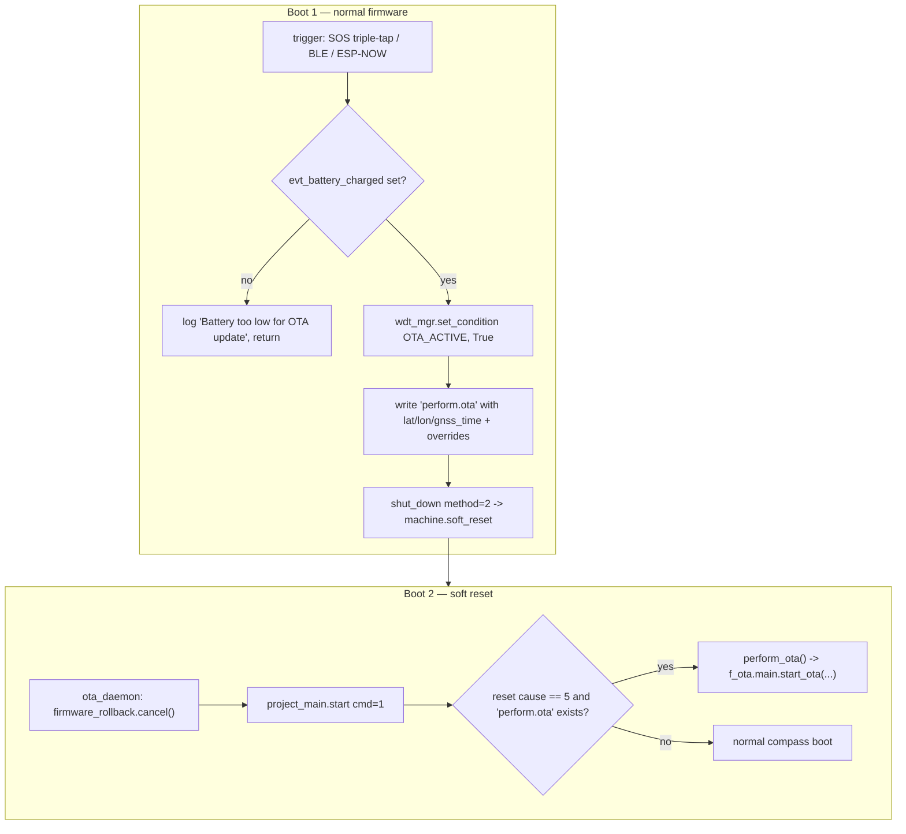
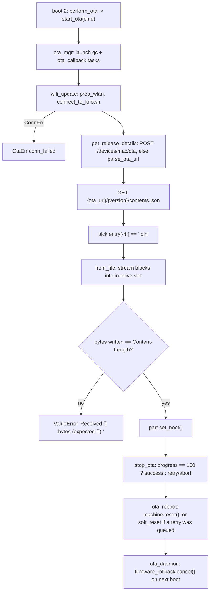

Updates are handled by the `f_ota/` package plus `f_lib/firmware_ota.py` and
`f_lib/firmware_rollback.py`. On current firmware (v5.0.3, `release_code` `5.0.3` /
`release_id` 339 / `device_type_id` 1 in `f_ota/system.py`) every update runs over
**station-mode WiFi**. The device-as-hotspot path (`f_ota/hotspot.py`) is compiled in but
imported by nothing and refuses to run — see [WiFi OTA](/protocols/wifi-ota).

<Note>
Everything on this page was read out of the frozen MicroPython bytecode in
`re/v5.0.3/mpy/*.dis`; citations are `file.dis:line`. Claims that could **not** be read
directly are marked **inferred** or **not recoverable**.
</Note>

The [ESP32 emulator](/reference/esp32-emulator#wifi-ota) runs this exchange, checks
everything the server says, and stops before writing a slot.

## An OTA is two boots, not one

This is the single most important structural fact, and earlier revisions of this page had
it wrong. **Nothing that triggers an OTA downloads anything.** A trigger only writes a
parameter file and reboots; the download happens on the *next* boot, from a different
entry point.



| Step | Evidence |
| --- | --- |
| Trigger battery-gates on an **event flag**, not a voltage | `if not modes.evt_battery_charged.is_set(): log.warn('Battery too low for OTA update'); return` — `compass.dis:6904` |
| Trigger sets the watchdog condition | `wdt_mgr.set_condition(WdtConditions.OTA_ACTIVE, True)`; `OTA_ACTIVE = 2` (`wdt_manager.dis:150`, alongside `BOOT_POWER_ON=0`, `BLE_ACTIVE=1`, `BOOT_SHUTDOWN=3`) |
| Trigger writes `perform.ota` | with `lat`/`lon`/`gnss_time` only when `config.lat and config.lon and config.last_gnss_unix` are all truthy; otherwise it creates an **empty** file via `open('perform.ota','w')` (`compass.dis:6904`) |
| Trigger reboots | `await self.shut_down(method=2)` → `device_power.shut_down_tasks(method=2)` → `machine.soft_reset()` (`compass.dis:5256`, `device_power.dis:203`) |
| Boot 2 cancels rollback first | the boot chain is `_boot.py` (mount VFS) → `main.py` (`try: from ota_daemon import *`) → `ota_daemon.py`, which does `from f_lib.firmware_rollback import cancel; cancel()` **before** `from project_main import *` (`main.dis`, `ota_daemon.dis`). `project_main`'s module body ends with `start(1)` (`project_main.dis:421`) |
| Boot 2 gates on reset cause | inside `project_main.start(cmd=1)`: `if _reset_cause == 5: if exists('perform.ota'): perform_ota(); return` (`project_main.dis:1220`). Reset cause 5 is `machine.SOFT_RESET` (**inferred** — the constant is compared numerically and never named in the bytecode). The same check at module level does `WDT.delete()` (`project_main.dis:343`) |

### The `perform.ota` handoff

`project_main.perform_ota()` (`project_main.dis:446`) reads the file, **deletes it
unconditionally** (so it is one-shot, whether or not it parsed), fills in defaults and
calls `f_ota.main.start_ota`:

```python
d = rebuild_obj('perform.ota') or {}     # False on missing/unparsable -> {}
os.remove('perform.ota')
cmd     = d.get('ota_cmd', 4)
version = d.get('version', 'latest')
branch  = d.get('ota_branch', 'totem_compass/totem') or 'totem_compass/totem'
d.setdefault('endpoint_id', 2)
d.setdefault('is_forced', True)
for k in ('ota_cmd', 'ota_branch', 'version'):
    d.pop(k, None)
url = 'http://datapeak-developer.s3.us-east-1.amazonaws.com/{}'.format(branch)
start_ota(cmd, version=version, ota_url=url, enable_gc=True,
          callback=show_ota, is_await_cb=True, **d)
```

Every remaining key of the file is forwarded as a keyword argument, and
`f_ota.main.start_ota` applies each one with `setattr(cfg, k, v)` **only if
`hasattr(cfg, k)`** — so unknown keys are silently dropped (`f_ota_main.dis:1221`).
Recognised keys are therefore exactly the attributes of `f_ota.config.Config`
(see [OTA session config](#ota-session-config)).

The BLE app sends these same fields: `ble_manager.handle_ota()` unpacks `<bBbbbh` plus two
length-prefixed strings and returns `{'ota_branch', 'ota_cmd', 'version', 'endpoint_id'}`
(`ble_manager.dis:5727`). `project_main.force_ota(branch='totem_compass/pre_alpha',
version='latest', **kw)` is the REPL equivalent — note the **`pre_alpha`** branch default
(`project_main.dis:386`). It fills in `ota_cmd=3` and `is_verbose=True` if absent, writes
`perform.ota` and calls `machine.soft_reset()` (`project_main.dis:911`).

<Warning>
`perform.ota` is written with `f_lib.file_mgr.save_obj`, a plain
`open(path, 'w')` + `json.dump` with no temp-file/rename (`f_lib_file_mgr.dis:1202`). A
power loss mid-write leaves a truncated file; `rebuild_obj` then returns `False` and the
next boot falls back to the defaults above rather than failing.
</Warning>

## Trigger sources

| Trigger | Path |
| --- | --- |
| SOS button triple tap | `sw_sos.cb_triple_tap` → `compass.start_ota`. The SOS button is a physical `button.AsyncButton`, **not** the capacitive Touch Crystal (`touch_button_v2`). See [physical buttons](/subsystems/power#physical-buttons-power--sos) |
| Phone app over BLE | `ota_ble.py` / `ble_manager.handle_ota` → same `perform.ota` file |
| ESP-NOW / [demi-god](/protocols/demigod) broadcast | `cb_start_ota` on `espnow_conn_v2`, `demigod_gen_ota_update` |
| REPL | `project_main.force_ota()`, or `ota_daemon.start_ota(cmd, version, url, networks, **kw)` which calls `f_ota.main.start_ota` directly with `enable_gc=True` (`ota_daemon.dis`) |

## Command IDs

`f_ota.main.ota_mgr(cmd)` is the dispatcher, and the `cmd` number decides what kind of
update runs (`f_ota_main.dis:1076`):

| `cmd` | Behaviour |
| --- | --- |
| `-1` | `log.warn('Manually rolling back firmware')`, `firmware_rollback.force()`, `ota_reboot()` |
| `1` | Preview update via WiFi (`.tgz`) |
| `2` | `raise OtaErr('OTA Hotspot has been sunset', ErrCode.operation_failed)` |
| `3` | Firmware update via WiFi (`.bin`) |
| `4` | Firmware update via WiFi (`.bin`) — identical handling to `3` in `wifi_update` |
| `10` | `from f_lib.ota.status import status; status()` — that module is **not** among the 94 frozen modules, so this branch raises `ImportError` on v5.0.3 |

Defaults differ by entry point: `f_ota.main.start_ota(cmd=1, **kwargs)`
(`f_ota_main.dis:162`), `ota_daemon.start_ota(cmd=1, …)`, but
`project_main.perform_ota()` uses `d.get('ota_cmd', 4)` — so the SOS/BLE path with no
explicit command performs a **firmware** update.

## Package formats

The package type follows `cmd`, not the update method. `cfg.update_method` is a different
thing entirely: `1` means "use `cfg.ota_url` as given", `2` means "ask the API where to
look" — `start_ota` sets it to `2` whenever `cfg.endpoint_id and cfg.version`
(`f_ota_main.dis:1221`).

| Format | Selected by | Handling |
| --- | --- | --- |
| `.bin` | `cmd in (3, 4)` | `Performing Firmware update via WiFi` → `install_firmware_update()` streams the image straight from the HTTP socket into the inactive OTA slot. Never stored in the filesystem |
| `.tgz` | `cmd == 1` | `Performing Preview update via WiFi` → `install_preview_update()` downloads to `cfg.save_to`, then `install_preview()` runs `unzip_tar` → `unpack_tar` → `move_files(source_dir=cfg.save_to, dest_dir='', excluded=[…])`, i.e. it **overwrites files at the filesystem root** (`f_ota_install_ota.dis:268`) |

`cfg.save_to` defaults to `'next'` (`f_ota_config.dis` `Config.__init__`), and `start_ota`
strips `/` from it and raises `OtaErr('You cannot save downloads to root directory',
ErrCode.param_invalid)` if it ends up empty. `get_release_contents()` `rmtree`s the
directory if it exists, else `mkdir`s it (`f_ota_install_ota.dis:404`).

If the expected member is absent the update aborts:
`.tgz package not found in repo, cannot perform OTA` /
`.bin package not found in repo, cannot perform OTA` (`ErrCode.not_found`).

`contents.json` is a JSON **array of filenames**. The pick is a fixed 4-character slice
comparison, not `str.endswith` (`f_ota_install_ota.dis:1191`):

```python
def _get_update_file(data, file_ex):
    for entry in data:
        if entry[-4:] == file_ex:
            return entry
    return None
```

so only 4-character extensions (`.bin`, `.tgz`) can ever match, and the *first* match wins.

## OTA server contract (WiFi path)

Plain HTTP against `http://api.totemportal.com` (`API_ENDPOINT`, `f_ota_system.dis`) and
whatever host the release points at. There is **no API key, client certificate, HMAC or
image signature** anywhere on this path, so a server you control can push firmware to a
device you own (see [Integrity](#integrity)).

`{MAC}` below is `f_lib.bitwise.get_mac_addr()` =
`''.join('{:02x}'.format(b) for b in machine.unique_id())` — 12 **lower-case** hex
characters, no separators (`f_lib_bitwise.dis:158`). Earlier revisions of this page said
upper-case; that was wrong.

<Steps>
  <Step title="Device polls for a release (only when update_method == 2)">
    `POST http://api.totemportal.com/devices/{MAC}/ota`, `Content-Type: application/json`,
    body of **exactly seven** keys (`get_release_from_api`, `f_ota_install_ota.dis:672`):

    ```json
    {"version": "latest", "endpoint_id": 2, "device_type_id": 1,
     "lat": null, "lon": null, "gnss_time": 0, "release_id": 339}
    ```

    - `version` is `cfg.version`, the version being **asked for** (`'latest'` unless
      `perform.ota` said otherwise) — *not* the running release code.
    - `release_id` is `syst.release_id or 0` → 339 on v5.0.3, 335 on v5.0.2.
    - `device_type_id` is `syst.device_type_id` → 1.
    - `gnss_time` is `cfg.gnss_time or 0`, but `lat` and `lon` are emitted as raw
      `cfg.lat` / `cfg.lon` and stay `null` when there is no fix. The function computes
      `or 0` fallbacks for lat/lon into locals and then never uses them — dead code.

    On `RequestErr` it logs `Rest Error: {}` and returns `False`; on any other exception
    `Cannot reach server` and returns `False`. Neither aborts the OTA — `get_release_details`
    then falls back to the on-device URL.
  </Step>
  <Step title="Server returns the release inside a 'body' object">
    The reply is parsed by `f_lib.requests.rest`, which requires `200 <= status < 300` and
    JSON that is not empty-ish (`Endpoint unavailable: {}` / `Response payload unparsable`,
    `f_lib_requests.dis:1696`). The device then existence-checks six keys **inside
    `resp['body']`**:

    ```json
    {"body": {"endpoint": "http://<host>/totem_compass/totem",
              "release_code": "5.0.3",
              "release_id": 339,
              "product_name": "totem_compass",
              "branch_name": "totem",
              "device_id": "…"}}
    ```

    | Response key | Assigned to | Condition |
    | --- | --- | --- |
    | `endpoint` | `cfg.ota_url` | only together with `release_code` |
    | `release_code` | `cfg.release_code` **and** `cfg.version` | |
    | `product_name` | `cfg.product` | if truthy |
    | `branch_name` | `cfg.branch` | if truthy |
    | `release_id` | `cfg.release_id` | if truthy |
    | `device_id` | `syst.device_id` | only if `syst.device_id is None` |

    `get_release_from_api` returns `True` only when **both** `endpoint` and `release_code`
    were present. Any other shape (including flat top-level keys) is ignored silently.
  </Step>
  <Step title="Fallback: parse the on-device URL">
    If the poll did not return `True`, `get_release_details` falls back to
    `parse_ota_url(cfg.ota_url)` (`f_ota_main.dis:1172`): strip `/`, split on `/`, and if
    there are exactly 5 parts take `parts[3]` as the product and `parts[4]` as the branch.
    `cfg.release_code` is then set to the *requested* version. With the default
    `http://datapeak-developer.s3.us-east-1.amazonaws.com/totem_compass/totem` that yields
    `totem_compass` / `totem`. Both halves failing is not an error here — `wifi_update`
    only raises `OTA URL or release ID must be specified` when `update_method == 1` **and**
    `cfg.ota_url` is empty.

    With `cfg.is_verbose` the five banner lines print: `Product:.......{}`,
    `Branch:........{}`, `Release Code:..{}`, `Release ID:....{}`, `OTA URL:.......{}`.
  </Step>
  <Step title="Device fetches the package index">
    `GET {cfg.ota_url}/{cfg.version}/contents.json`, with `?uid={cfg.uid}` appended when
    `not cfg.is_cached` (`get_release_contents`, `f_ota_install_ota.dis:404`).

    `cfg.uid = rand_key(length=8)` — 8 characters drawn from the 62-character alphabet
    `A–Za–z0–9` as `char_str[urandom(1)[0] % 62]` (`f_lib_helpers.dis`). It is a
    cache-buster seeded from `os.urandom`, **not** derived from the MAC or the clock. (The
    `% 62` gives a slight bias toward the first eight characters; irrelevant for its
    purpose.) `cfg.is_cached` defaults to `True`, so the parameter is normally absent; it
    is cleared when `cfg.version == 'dev'` or when a trigger passes `is_cached=False`
    (`f_ota_main.dis:1221`).

    `validate_resp` accepts any `200 <= status < 300`, else
    `OtaErr('Could not access: {}', ErrCode.not_found)`. Empty/unparsable JSON →
    `contents.json syntax err, cannot parse` (`ErrCode.param_invalid`).
  </Step>
  <Step title="Device downloads and installs">
    The chosen filename is appended to the same base:
    `{cfg.ota_url}/{cfg.version}/{filename}` (`_get_endpoints`, which simply returns
    `[url_base + '/' + name, dest_dir + '/' + name]`), logged as `Firmware URL: {}`.

    The version the device *thinks* it is installing is parsed from the whole URL:

    ```python
    version = firmware_url.split('_v')[-1].lower()
    ota_status.version = '.'.join(version.split('.')[:-1])
    ```

    A name without `_v` produces garbage with no exception. If it equals
    `syst.release_code` and `not cfg.is_forced`, the device logs
    `Desired release already installed on device` — and then **downloads and flashes it
    anyway**; the check has no early return (`f_ota_install_ota.dis:1017`).
  </Step>
  <Step title="Device reboots and reports">
    After a successful install the OTA callback posts
    `POST http://api.totemportal.com/devices/{MAC}/ota?updated` with **exactly ten** keys
    (`record_release`, `ota_callback.dis:974`):

    ```json
    {"boot_count": 0, "branch": "totem", "device_age": 0, "device_type_id": 1,
     "product": "totem_compass", "release_code": "5.0.3", "release_id": 339,
     "lat": null, "lon": null, "gnss_time": 0}
    ```

    sourced from `config.boots`, `cfg.branch`, `config.age`, `syst.device_type_id`,
    `cfg.product`, `cfg.release_code`, `cfg.release_id`, `config.lat`, `config.lon`,
    `config.last_gnss_unix`. If the reply carries `body.device_id` and `syst.device_id` is
    still `None`, it is stored and `system.json` is rewritten. A custom server need only
    accept it with 2xx.
  </Step>
</Steps>

## The install path in detail

`wifi_update(cmd)` (`f_ota_main.dis:620`):

1. `update_method == 1` and no `cfg.ota_url` → `OtaErr('OTA URL or release ID must be specified', ErrCode.param_missing)`.
2. `networks = get_known_networks()`; `hostname = '{}_{}'.format(cfg.hostname, cfg.mac[-4:])` (`cfg.hostname` defaults to `'mytotem'`).
3. `ota_status.step_id = 2`; `await prep_wlan()`.
4. `priority_nw = user_cfg.wifi_ssid or None`.
5. `await local_wifi.connect_to_known(networks=…, hostname=…, priority_nw=…)`; `ConnErr` is re-raised as `OtaErr('{} | code: {}', ErrCode.conn_failed)`.
6. `Connected to WiFi`; `cfg.rec_time('Connected to WiFi')`; `ota_status.step_id = 4`.
7. `get_release_details(cfg.endpoint_id, cfg.version)` then `install_preview_update()` or `install_firmware_update()`.
8. `ota_status.step_id = 6`.

`prep_wlan()` is `Preparing WLAN protocols for update (v2)...` →
`await local_wifi.disconnect(power_off=True)` → `wlan.active(True)` →
`sleep_ms(300)` → `protocol = 7`, `pm = 0`, `wlan.config(protocol=7)`,
`wlan.config(pm=0)` → `WLAN prep completed` (`f_ota_main.dis:437`). Despite the `(v2)`
in the string, `f_ota/main.py` imports `ConnErr, WiFi, CLIENT` from **`f_lib.wifi`**, not
`f_lib.wifi_v2` (`f_ota_main.dis:162`).

### Writing the firmware image

`install_firmware_update` hands off to a background task and polls
(`f_ota_install_ota.dis:1017`):

```python
tasks.launch(from_file, url=firmware_url, ota_status=ota_status)
t0 = time.ticks_ms()
while True:
    if ota_status.code == 3: cfg.is_graceful = True; break
    if ota_status.progress == 100 and ota_status.firmware_completed.is_set(): break
    if time.ticks_diff(time.ticks_ms(), t0) > 300000:
        raise OtaErr('Firmware update took too long', ErrCode.timeout)
    await asyncio.sleep_ms(100)
```

`f_lib.firmware_ota.from_file` (`f_lib_firmware_ota.dis:1212`) opens the URL, requires
status **exactly 200** (`HTTP Error: {}`), records `resp.content_length` into
`ota_status.download_size`, and streams through `BlockDevWriter.write_from_stream`: a
`memoryview(bytearray(device.blocksize))` buffer, `asyncio.sleep_ms(10)` every 10th block,
`ota_status.downloaded_bytes = written`, `ota_status.progress = round(written /
download_size * 100)`. On close it calls `part.set_boot()` and prints
`OTA Partition '{}' updated successfully.` then
`Will boot from '{}' partition on next boot.`; if the boot partition does not read back as
expected it prints `Failed to set {} as the next boot partition.` and sets
`ota_status.code = 3`.

The preview path uses `f_lib.requests.Downloader.file(url, dest, pause_ms=20)` instead —
a 160-byte read buffer, `\rDownloaded: {} of {} bytes | {}% complete` progress, wrapped in
`asyncio.wait_for(..., 90)` and followed by a `while dl.pct != 100` poll (10 ms steps) that
bails after 100 s (`Update took too long to download` / `Firmware update took too long`).

## Install flow



## Status, errors and steps

`OtaStatus` (`f_ota/config.py`, `f_ota_config.dis`) has **twelve** fields, not four:

| Field | Default |
| --- | --- |
| `block_no` | `0` |
| `code` | `0` (`3` = failed) |
| `downloaded_bytes` | `0` |
| `download_size` | `0` |
| `firmware_completed` | `asyncio.Event()` |
| `is_firmware_ota` | `False` |
| `is_wifi_ota` | `True` |
| `progress` | `0` |
| `project_ready` | `asyncio.Event()` |
| `step_id` | `1` |
| `version` | `None` |
| `release_prev` | `None` (set to `syst.release_id` by `get_release_from_api`) |

`step_id` is only ever assigned in `f_ota/config.py`, `f_ota/main.py` and the dead
`f_ota/hotspot.py` (`grep -n 'STORE_ATTR step_id' *.dis` → five sites): `1` at
construction, `2` before WLAN prep, `4` after connecting, `6` after the installer returns,
`7` after a successful `stop_ota`. The value `3` is set **only** by the sunset hotspot
server, which is why the LED callback's `step_id >= 3` test looks off-by-one on the
surviving path.

`OtaErr(msg, code)` is an `Exception` subclass carrying `msg` and `code`
(`f_ota_config.dis`). The `ErrCode` members referenced on this path are
`param_missing`, `param_invalid`, `not_found`, `conn_failed`, `timeout`,
`operation_failed`, `invalid_auth`.

`OTA_ACTIVE = 2` is a `WdtConditions` watchdog state (`wdt_manager.py`), not an
`OtaStatus` member; `OTA_MIN` / `OTA_MAX` belong to rollback.

### OTA session config

<Warning>
There are **two unrelated classes named `Config`**. `f_ota.config.Config` is the ephemeral
OTA session state described here. `project_data.Config` is the persisted device
configuration serialised to `config.json`. They share no fields and no code.
</Warning>

`f_ota.config.cfg` is a module-level singleton whose defaults are
(`f_ota_config.dis`, `Config.__init__`):

`attempt_count=0`, `callback=None`, `enable_gc=False`, `endpoint_id=None`,
`freq_hz=None`, `gnss_time=None`, `hostname='mytotem'`, `is_await_cb=False`,
`is_blocking=False`, `is_cached=True`, `is_del_vfs=True`, `is_forced=False`,
`is_graceful=False`, `is_reboot=True`, `is_verbose=False`, `lat=None`, `lon=None`,
`mac=None`, `networks={}`, `ota_url=None`, `max_retries=0`, `save_to='next'`, `uid=None`,
`update_method=1`, `version='latest'`, `branch=''`, `product=''`, `release_code=''`,
`release_id=None`, plus private `_start_time` / `_time` used by `rec_time()` and the
`show_time()` timing table.

Importing `f_ota/main.py` also sets `cfg.freq_hz = machine.freq()`,
`cfg.mac = get_mac_addr()`, builds `local_wifi = WiFi(mode=CLIENT)` and loads
`user-config.json` into `user_cfg` (`f_ota_main.dis:162`).

`cfg.is_graceful` reads backwards from its name: `stop_ota` sets it to `True` whenever
`ota_status.progress != 100`, i.e. it marks a **handled failure**, and
`start_ota` returns `not cfg.is_graceful` (`f_ota_main.dis:800`, `:1221`).

## Retry, cleanup and reboot

`stop_ota(cmd)` runs in a `finally:` on every exit (`f_ota_main.dis:800`), logging
`Cleanly exiting OTA`:

- **On failure** (`progress != 100`): `ota_status.code = 3`; if `ota_status.is_wifi_ota`
  and `cfg.max_retries > 0`, it decrements `max_retries` and writes a fresh `perform.ota`
  containing `{'ota_cmd': cmd, 'max_retries': …, 'attempt_count': cfg.attempt_count + 1,
  'version': cfg.version}` (plus `networks` if set), then arranges a **soft** reset so the
  next boot retries. `cfg.max_retries` defaults to `0`, so nothing retries unless a
  trigger asked for it. `Attempt: {} of {}` is logged at the top of `start_ota`.
- **On success**: `OTA completed successfully!`, `cfg.show_time()`,
  `save_obj('system.json', syst)`, `ota_status.step_id = 7`.
- Either way, if `cfg.callback` and `cfg.is_await_cb` it waits on
  `ota_status.project_ready`, which the LED callback sets when it is done.
- `if cfg.is_del_vfs and ota_status.is_firmware_ota: del_vfs()` — and `is_del_vfs`
  defaults to **`True`**. `del_vfs()` walks `os.ilistdir()` at the root, `rmtree`s every
  directory and `os.remove`s every `*.mpy` file (`f_ota_main.dis:350`). After a firmware
  update the VFS is deliberately wiped so the new image's frozen modules take effect.
- `cmd in (1,2,3,4)` → `await local_wifi.disconnect()`; stops the `ota_callback` and
  `garbage_collection` tasks; `Ending Free mem: {}`.
- `if cfg.is_reboot` (default `True`): sleeps 5 s first if the run failed, then
  `ota_reboot(delay_sec=0, is_soft_reset=<retry pending>)`, which counts down with
  `\rRebooting device in {:2} seconds (ctrl-C to cancel)` and calls `machine.soft_reset()`
  or `machine.reset()`.
- Finally restores `machine.freq(cfg.freq_hz)`.

## LED feedback during an OTA

`ota_callback.ProjectOta.start()` runs as the `ota_callback` task for the whole update
(`ota_callback.dis:497`). Earlier revisions of these pages said no firmware string bound a
colour to an OTA state; that was wrong — the mapping is in bytecode, not strings.

| Phase | Indication |
| --- | --- |
| Whole update | Touch Crystal twinkles through `[(200,0,200), (100,0,200), (0,0,200)]` — magenta → violet → blue — `per_ms=80, fade_step=1, bright=0.3, min_brt=10` |
| Searching / connecting (`step_id < 3`) | `search_for_wifi` chases a **white** comet around the 60-pixel ring: head at `GLOBAL_BRT` (0.6), tail at `0.3 / 0.25 / 0.2 / 0.15 / 0.07 / 0.02`, 50 ms per step |
| Connected (`step_id >= 3`) | `wifi_animation` task stopped, ring cleared |
| Downloading (`step_id >= 4`) | `leds.ring.progress(px_range=(0, px), rgb=PROGRESS_RGB)` where `px = int(progress/100 * span)`. `PROGRESS_RGB = dim_leds(colors.white, 0.3)` — a **white** progress ring |
| Failure (`status.code == 3`) | ring fills `ERROR_RGB` for 200 ms, off 200 ms, fills again for 400 ms, off — then `project_ready.set()` and return. `ERROR_RGB = dim_leds(colors.orange, GLOBAL_BRT)`, `colors.orange = (255,128,0)`, `GLOBAL_BRT = 0.6` (`project_data.dis:515`, `:1902`) — the **orange failure blink** the user guide describes is real |
| After success | pending `events`/`debug` logs are uploaded to `{API}/events/{mac}` and `{API}/debug/{mac}` with a `LOG_RGB` (white) progress bar on the top of the ring, then `record_release()`, then ring and crystal off |

## Rollback & slot management

The image uses the standard **ESP-IDF OTA data** partition with two app slots plus a
factory image. `f_lib/firmware_rollback.py` is tiny — its only string literal is
`OTA rollback unsupported` — so the logic below was read from bytecode
(`f_lib_firmware_rollback.dis`):

| Symbol | Behaviour |
| --- | --- |
| `OTA_MIN` = `const(16)` (`0x10`), `OTA_MAX` = `const(32)` (`0x20`) | the ESP-IDF app-OTA partition-subtype range |
| `ota_partitions()` | `[p for p in Partition.find(Partition.TYPE_APP) if OTA_MIN <= p.info()[1] < OTA_MAX]`, sorted by subtype. The **factory** partition (subtype 0) is excluded |
| `cancel()` | `Partition.mark_app_valid_cancel_rollback()` inside `try/except OSError`; if `e.args[0] == -261` it prints `OTA rollback unsupported`, otherwise it **re-raises**. Earlier revisions said it caught `NotImplementedError` — it catches `OSError` |
| `force(reboot=True)` | finds the entry of `ota_partitions()` whose `info()` matches `Partition(Partition.RUNNING).info()`, calls `set_boot()` on `parts[i-1]`, then `machine.reset()` unless `reboot=False`. Note `i == 0` wraps to `parts[-1]`. If the running partition is not an OTA slot (e.g. factory), it falls through and raises `OSError(-261)` |

<Warning>
`cancel()` is called **unconditionally at every boot** from the top of `ota_daemon.py`,
before `project_main` is imported. The new image therefore self-confirms as soon as
MicroPython reaches the frozen `ota_daemon` module — ESP-IDF anti-rollback will not undo a
firmware that panics later in `project_main`. The only rollback that remains is the
app-driven `cmd == -1` path (`Manually rolling back firmware`, `f_ota_main.dis:1076`).
</Warning>

<Note>
The strings `ota data invalid, no current app. Assuming factory`, `not found otadata`,
`Rollback is not possible…` and `Running firmware is factory` do **not** appear in any of
the 94 frozen modules of v5.0.3 (nor in v5.0.2's 96). They belong to the native
bootloader, not to `f_lib/firmware_rollback.py`.
</Note>

## Integrity

- **The WiFi firmware path has no cryptographic check at all.** The only verification in
  `f_lib/firmware_ota.py` is a length comparison in `BlockDevWriter.close()`
  (`f_lib_firmware_ota.dis:639`):

  ```python
  if self.status.download_size and self.status.download_size != self.device.end:
      raise ValueError('Received {} bytes (expected {}).'.format(...))
  ```

  i.e. bytes written must equal the server's own `Content-Length`. There is no SHA-256,
  no signature, and `download_size` comes from the same response being validated. Beyond
  that, integrity rests on the stock ESP-IDF bootloader's image-hash check at boot
  (`Image hash failed - image is corrupt` is a native bootloader string, absent from the
  frozen bytecode — this wiring is **inferred**).
- **App-level SHA-256 exists only on the BLE transfer path.** `f_ble/chunking.py` (fed by
  `ota_ble.py`) compares a digest supplied in the transfer metadata:
  `File integrity confirmed!` / `SHA256 hash does NOT match` (`SHA256 final : {}`,
  `SHA256 origin: {}`). In v5.0.3 `sha256` appears in `f_ble_chunking.dis`,
  `ota_ble.dis`, `f_ble_file_upload.dis`, `f_lib_file_mgr.dis` (the last is new in
  v5.0.3, where `gen_file_hash(path, buff=None, yield_every=4)` is added) plus unrelated
  hits in `mip` and `peer_helpers`. It appears in **neither** `f_ota_install_ota.dis` nor
  `f_lib_firmware_ota.dis`.
- **No firmware signature on either path.** The `ECDSA with SHA256` / `ECP_VERIFY_FAILED`
  machinery belongs to the bundled mbedTLS stack and is not wired to the OTA install, so
  a custom OTA server needs no signing key.
- The preview (`.tgz`) path has no integrity check either, and it unpacks over the
  filesystem root.

<Warning>
Both the release poll and the download run over **HTTP** with no authentication. Anything
that can answer for `api.totemportal.com`, or for whatever host the API's `endpoint` field
names, can flash arbitrary code. See [WiFi OTA](/protocols/wifi-ota).
</Warning>

## Files the OTA path persists

| File | Written by | Contents |
| --- | --- | --- |
| `perform.ota` | `compass.start_ota`, `project_main.force_ota`, `stop_ota` (retry) | one-shot JSON dict of `start_ota` keyword overrides; deleted by `perform_ota()` on the next boot. May legitimately be **empty** |
| `user-config.json` | the (sunset) hotspot web UI | `f_ota.config.UserConfig` — exactly three fields: `name`, `wifi_ssid`, `wifi_key`. Loaded by `f_ota/main.py` at import; `wifi_ssid` becomes `priority_nw` and, with `wifi_key`, joins the known-network map |
| `system.json` | `stop_ota` on success, `record_release` when the API returns a new `device_id` | `f_ota.system.System.__dict__` — only `device_id` is instance state; `product` / `branch` / `release_code` / `release_id` / `device_type_id` are class attributes of `PermData` and are baked into the image |
| `config.json` | `project_data` (outside this subsystem) | `project_data.Config`, the persisted device configuration — a different class from `f_ota.config.Config` |

`save_obj(path, obj)` is `json.dump(obj if isinstance(obj, dict) else obj.__dict__, f)`
into a plain `open(path, 'w')`; on `OSError` with `errno == 28` it prints
`No space left on device to save file` and returns `False` (`f_lib_file_mgr.dis:1202`).
`rebuild_obj(path, obj=None, is_strict=False)` returns `False` for a missing or unparsable
file, returns the raw dict when `obj is None`, and otherwise `setattr`s only keys the
object already has — so a corrupt file silently leaves defaults in place
(`f_lib_file_mgr.dis:934`).
