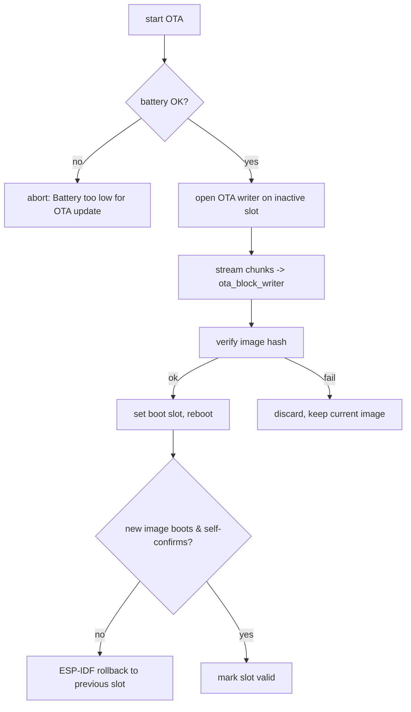

Updates are handled by the `f_ota/` package and `f_lib/firmware_*` modules, with two
delivery transports (BLE and WiFi) feeding one install path. On current firmware (v5.0.3,
`release_code` `5.0.3` / `release_id` 339 in `f_ota/system.py`) the WiFi path runs over
station WiFi — `OTA Hotspot has been sunset` — with the hotspot join kept only as a legacy
path for older firmware.

## Delivery paths

<CardGroup cols={2}>
  <Card title="Via app (BLE)" icon="bluetooth">
    The image streams over the chunked GATT transport
    (`ota_ble.py`, `svc_ble_transfer.py`): `Connected to OTA BLE`, `cb_start_ota`.
  </Card>
  <Card title="Via WiFi" icon="wifi">
    Current WiFi OTA runs over station WiFi: the release is resolved via
    `http://api.totemportal.com`, the package is fetched from datapeak S3, and the
    update is command-triggered over a WebSocket channel. The legacy hotspot path
    (`OTA Hotspot has been sunset`) — join `totemupdate`, download over HTTP — remains
    only for older firmware. See [WiFi OTA](/protocols/wifi-ota).
  </Card>
</CardGroup>

A [demi-god](/protocols/demigod) broadcast (`demigod_gen_ota_update`) can also tell a
group of nearby devices to update at once.

Locally, a **triple tap of the physical SOS button** calls `start_ota`
(`sw_sos.cb_triple_tap`, wired in `compass`; **confirmed**, identical in v5.0.2 and
v5.0.3). The SOS button is a `button.AsyncButton`, not the capacitive Touch Crystal
(`touch_button_v2`) — earlier revisions of this page had that wrong. See
[physical buttons](/subsystems/power#physical-buttons-power--sos).

## Package formats

The updater accepts two package types, one per **update method** — firmware vs
preview — selected by the `update method` field
(`Getting release details | update method: {} | endpoint_id: {} | version: {}`):

| Format | Method | Handling |
| --- | --- | --- |
| `.bin` | Firmware | a raw ESP-IDF app image written directly to the OTA slot (`Performing Firmware update via WiFi`, `install_firmware_update`, `from_firmware_file`) |
| `.tgz` | Preview | gzip + tar assets/content bundle, unpacked on-device (`f_lib/gzip.py`, `f_lib/tarfile.py`, `f_lib/unpack.py`) — carries assets/content, **not** the app image (`Performing Preview update via WiFi`, `install_preview`) |

If the expected package is absent the update aborts cleanly:
`.tgz package not found in repo, cannot perform OTA`,
`.bin package not found in repo, cannot perform OTA`.

A package index (`contents.json`, `Downloading content.json`) — a JSON **array of
filenames** — describes what to fetch; the device picks the entry ending in `.bin`
(firmware) or `.tgz` (preview). Assets and preferences can be pulled alongside
(`Download Compass Preferences`, `Download Developer Options`, `Downloaded preview`).

## OTA server contract (WiFi path)

The station-WiFi update is a plain-HTTP REST + fetch exchange against
`http://api.totemportal.com` (`API_ENDPOINT` — no TLS, no auth). A custom server
that answers these exchanges can push firmware to a device you own: there is **no API
key, client certificate, HMAC, or image signature** anywhere on this path (see
[Integrity](#integrity)).

<Steps>
  <Step title="Device polls for a release">
    `POST http://api.totemportal.com/devices/{MAC}/ota` with a JSON body
    (`get_release_from_api`). `{MAC}` is the uppercase-hex device MAC (`get_mac_addr`):

    ```json
    {"version": "5.0.3", "endpoint_id": 1, "device_type_id": 1,
     "lat": 0.0, "lon": 0.0, "gnss_time": 0, "release_id": 339}
    ```

    (`version` and `release_id` are the device's own `release_code` / `release_id` from
    `f_ota/system.py`: `5.0.3` / 339 on v5.0.3, `5.0.2` / 335 on v5.0.2. The other values are
    illustrative.)
  </Step>
  <Step title="Server returns a release object">
    The reply (`get_release_details`) must expose these fields:

    ```json
    {"ota_url": "http://<host>/repo/*", "version": "5.0.3",
     "product": "totem_compass", "branch": "totem",
     "release_code": "5.0.3", "release_id": 123}
    ```

    Logged as `Product:.......{}`, `Branch:........{}`, `Release Code:..{}`,
    `Release ID:....{}`, `OTA URL:.......{}`.
  </Step>
  <Step title="Device fetches the package index">
    `GET {ota_url}/contents.json` (`?uid=` appended when uncached) returns a JSON
    **array of filenames** (`contents.json syntax err, cannot parse` on bad JSON). The
    device picks the entry ending in `.bin` (firmware) or `.tgz` (preview) — e.g.
    `["firmware_v5.0.3.bin"]`. The version is parsed as the substring between `_v` and
    the extension.
  </Step>
  <Step title="Device downloads, verifies, flashes, reboots, acks">
    The picked file is downloaded (`.bin` streamed to the OTA slot; `.tgz` unpacked to
    VFS), verified by **SHA-256 only**, flashed, and the device reboots. It then reports
    success with `POST http://api.totemportal.com/devices/{MAC}/ota?updated`
    (`record_release`, `Recording OTA release`) — a JSON body carrying `boot_count`,
    `branch`, `device_age`, `device_type_id`, `product`, `release_code`, `release_id`,
    `lat`, `lon`, `gnss_time`. A custom server need only accept it with 200.
  </Step>
</Steps>

## Install flow



| Stage | Modules / evidence |
| --- | --- |
| Battery gate | `Battery too low for OTA update` (string in `compass.py`; exact voltage/percent threshold lives in bytecode — not recoverable from strings) |
| Block write | WiFi `.bin` streams through `f_lib/firmware_ota.py` (`BlockDevWriter`, `Ota.from_firmware_file`); the slot/volume writer `ota_block_writer.py` (`OtaWriter`, `BlockDev`, `Volume`) reports `Firmware successfully written to: {}`. `download_size` / `downloaded_bytes` are `OtaStatus` fields (`f_ota/config.py`) |
| Progress | `\rDownloaded: {} of {} bytes \| {}% complete` (`f_lib/requests.py`) |
| Callbacks | `ota_callback.py` (`record_release`, `show_ota`), `ota_daemon.py` (`start_ota`, defaults `cmd=1, version='latest'`); `cb_start_ota` is a callback attribute wired on `compass` / `espnow_conn_v2`, and `compass.start_ota` is also the SOS button's triple-tap callback (`sw_sos.cb_triple_tap`); `close_ota` (`f_ble/chunking.py`) and `Closing OTA writer` (`ota_block_writer.py`) close the writer |
| Clean exit | `Cleanly exiting OTA` (`f_ota/main.py`) |
| Status/error types | `OtaStatus` (fields `block_no`, `code`, `downloaded_bytes`, `download_size`) and `OtaErr` (an exception carrying `msg`, `code`) — both classes in `f_ota/config.py`. `OTA_ACTIVE` = 2 is a separate `WdtConditions` watchdog state (`wdt_manager.py`), not an `OtaStatus` member; `OTA_MIN` / `OTA_MAX` belong to rollback (below) |

## Rollback & slot management

The image uses the standard **ESP-IDF OTA data** partition with two app slots plus a
factory image. `f_lib/firmware_rollback.py` drives recovery. In the frozen bytecode the
module is small — its **only** string literal is `OTA rollback unsupported` — and the
recovery logic is expressed as code, not log strings:

| Symbol (`f_lib_firmware_rollback.dis`) | Meaning |
| --- | --- |
| `cancel()` | calls `Partition.mark_app_valid_cancel_rollback()` (cancels the IDF anti-rollback watchdog); catches `NotImplementedError` and, when its `[0]` code `== -261`, logs `OTA rollback unsupported` |
| `force(reboot)` | app-level manual rollback: enumerates app partitions, finds the `RUNNING` one, sets the boot partition to the previous OTA slot, then optionally `machine.reset()` |
| `ota_partitions()` | lists the app partitions whose subtype falls in the OTA range |
| `OTA_MIN` = 16 (`0x10`), `OTA_MAX` = 32 (`0x20`) | the ESP-IDF app-OTA partition-subtype range used to select slots (numeric values recovered from the disassembly, not merely symbols) |

`mark_app_valid_cancel_rollback` confirms a good image (cancelling the IDF anti-rollback
watchdog); the app-driven manual trigger `Manually rolling back firmware` lives in
`f_ota/main.py`, alongside this module's `force()` path and the IDF partition mechanism. A
failed or non-self-confirming update reverts to the previous good slot. The "orange blink"
failure indicator is described in the user-facing update guide; no firmware string binds an
orange blink specifically to OTA failure or rollback.

<Note>
The strings `ota data invalid, no current app. Assuming factory`, `not found otadata`,
`Rollback is not possible…`, and `Running firmware is factory` do **not** appear in any of
the 94 frozen modules of v5.0.3 (nor in v5.0.2's 96) and are not part of
`f_lib/firmware_rollback.py`; the module's decision logic is carried in bytecode as shown
above.
</Note>

## Integrity

- **App-level SHA-256 verification lives on the BLE transfer path**, not the WiFi install.
  `f_ble/chunking.py` (fed by `ota_ble.py`) compares a digest: `File integrity confirmed!`
  on match, `SHA256 hash does NOT match` on mismatch (`SHA256 final : {}`,
  `SHA256 origin: {}`; qstrs `sha256_expected`, `sha256_feed`, `sha256_hash`). In the
  v5.0.3 disassembly `sha256` appears in `f_ble_chunking.dis`, `ota_ble.dis`,
  `f_ble_file_upload.dis`, and `f_lib_file_mgr.dis` — the last is new in v5.0.3, where
  `f_lib/file_mgr.py` gains an async SHA-256 helper `gen_file_hash(path, buff=None, yield_every=4)`
  — plus unrelated references in `mip` and `peer_helpers` (present in both versions). There
  is **no** SHA-256 in `f_ota/install_ota.py` or in the WiFi streaming writer
  `f_lib/firmware_ota.py`.
- **The WiFi `.bin` path relies on the ESP-IDF bootloader image hash.**
  `f_lib/firmware_ota.py` (`BlockDevWriter` / `Ota.from_firmware_file`) streams blocks to
  the inactive slot and sets the boot partition
  (`Will boot from '{}' partition on next boot.`) with no app-level digest of its own; integrity of a WiFi firmware image therefore
  rests on the stock ESP-IDF bootloader's image-hash check at boot
  (`Image hash failed - image is corrupt` — a native bootloader string, not present in the
  frozen bytecode, so this wiring is inferred). The expected SHA-256 that the BLE path
  checks is carried in the transfer metadata, not derived from transport security.
- There is **no firmware signature** on either OTA path. The `ECDSA with SHA256` /
  `ECP_VERIFY_FAILED` machinery in the image belongs to the bundled mbedTLS/TLS stack and
  is **not** wired to the OTA install, so a custom OTA server needs no signing key.

<Warning>
The download itself was observed over **HTTP** (not HTTPS). Update integrity therefore
relies on image-level verification and rollback rather than transport security. See
[WiFi OTA](/protocols/wifi-ota).
</Warning>
